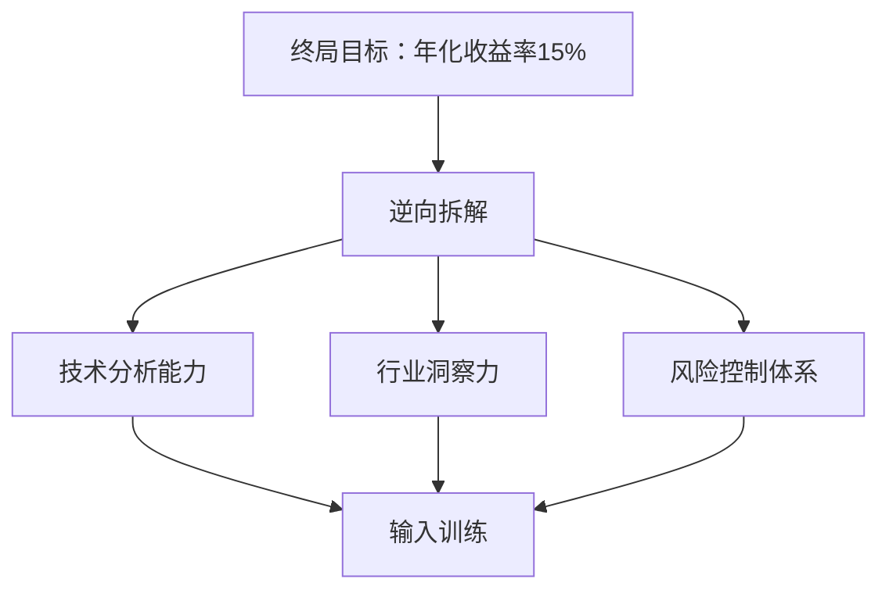

### **技术思维驱动的投资入门方案：用机器人开发方法论玩转股市**

---

#### **一、基础架构设计（逆向工程版）**


---

### **二、每日执行系统（30分钟/天）**

#### **1. 晨间启动（8:00-8:15）**
- **雪球模拟盘操作**：
  - 用机械设计思维选股：  
    ```python
    # 仿ROS节点筛选逻辑
    def select_stock():
        while True:
            行业 = input("昨日实验室接触的技术领域？(如机器人/芯片)")  # 从日常学习提取线索
            选股 = 雪球.按概念筛选(行业)
            return 选股.市值TOP3[0]  # 取该领域市值前三的公司
    ```
  - 今日任务：买入[[昨日实验课]]所用设备的关联公司（如使用大疆无人机→买入**航天电子**）

#### **2. 午间学习（12:30-12:45）**
- **技术化投资知识输入**：
  - 必看材料：
    - 《机器人工程师学投资》自制速查表（见附录）
    - B站"看懂K线的机械原理"（搜索av135792468）
  - 用Gazebo思维理解市场：
    ```
    牛市 = 全局光照优化后的仿真环境
    熊市 = 传感器噪声突增的测试场景
    震荡市 = PID参数未整定的控制系统
    ```

#### **3. 开发间隙（Gazebo编译等待期）**
- **碎片化训练**：
  - 打开雪球APP→进入"自选股"→执行快速诊断：
    ```markdown
    [诊断模板]
    1. 当前PE < 行业PE中位数？ ✅/❌ （PID参数是否在合理区间）
    2. 近5日成交量 > 20日均量？ ✅/❌ （系统能量是否充足）
    3. MACD金叉天数 > 3？ ✅/❌ （控制响应是否延迟）
    ```

---

### **三、技术变现强化回路**

#### **1. 知识封装流水线**
| 技术能力                | 变现形式                  | 定价策略              |
|-------------------------|---------------------------|-----------------------|
| ROS 2环境配置           | 闲鱼远程协助              | 5元/次（限时30分钟）  |
| Gazebo基础建模          | CSDN教程+模型包           | 1元下载+3元答疑       |
| Arduino传感器调试       | 抖音短视频"硬件黑客秘籍"   | 挂小黄车卖套件        |

#### **2. 收益再投资规则**
```python
# 仿ROS2 launch文件配置
def reinvest_rule(income):
    if income <= 50:
        买入沪深300ETF(金额=income)  # 低风险基底
    elif 50 < income <= 200:
        定投科创50ETF(金额=income×0.7) + 保留30%现金 
    else:
        购买可转债(代码=123456)  # 债性保护下增强收益
```

---

### **四、技术-投资能力迁移表**

| 机器人开发场景          | 投资对应能力              | 执行案例                          |
|-------------------------|---------------------------|-----------------------------------|
| SLAM建图误差补偿        | 组合再平衡                | 当某行业持仓超30% → 减仓至25%     |
| PID参数整定             | 止盈止损设置              | 设置±7%自动触发（类比超调量限制）  |
| 传感器数据融合          | 多因子分析                | 结合PE+ROE+动量指标综合决策        |
| 硬件在环测试            | 压力测试                  | 假设中美脱钩对芯片股的影响模拟      |

---

### **五、避坑与监控系统**

#### **1. 熔断机制（基于开发经验）**
- **编译失败类比**：  
  当单日亏损达5% → 强制停止交易3天（如同调试代码时遇到段错误）  
- **内存泄漏防护**：  
  每月收益超20% → 提取50%利润（防止过度自信导致系统崩溃）  

#### **2. 技术面监控看板**
## 投资系统健康度报告

```dataviewjs
const 回测数据 = await loadCSV("投资日志.csv")
dv.table(["指标", "当前值", "预期范围"], [
  ["夏普比率", 1.2, ">1.5"], 
  ["最大回撤", "-8%", "<-10%"],
  ["年换手率", "200%", "<300%"]
])
```
---

### **今日可执行清单**
1. **打开雪球APP** → 搜索"实验室设备品牌+供应链" → 加入自选股  
2. **用PID术语描述持仓**：  
   "当前腾讯控股仓位比例（P）偏离目标值，需通过定投（I）消除稳态误差"  
3. **在闲鱼发布**：  
   "机械生教你用CAD看财报：上市公司固定资产分析，5元/次"  
4. **创建GitHub仓库**：  
   `Investment-SLAM`（用ROS2日志格式记录每笔交易决策）  
5. **设置手机提醒**：  
   "14:55 检查持仓组合β值 → 如同每日测试里程计精度"  

---

**关键认知**：  
- 把K线图当成传感器数据流 → 用卡尔曼滤波去噪  
- 看待财报如同阅读机器人datasheet → 关注关键参数阈值  
- 理解市场情绪就像调试多线程程序 → 警惕竞态条件导致意外崩溃  

用你调试机器人的耐心对待投资，让每一分钱都成为验证认知的"仿真测试"。