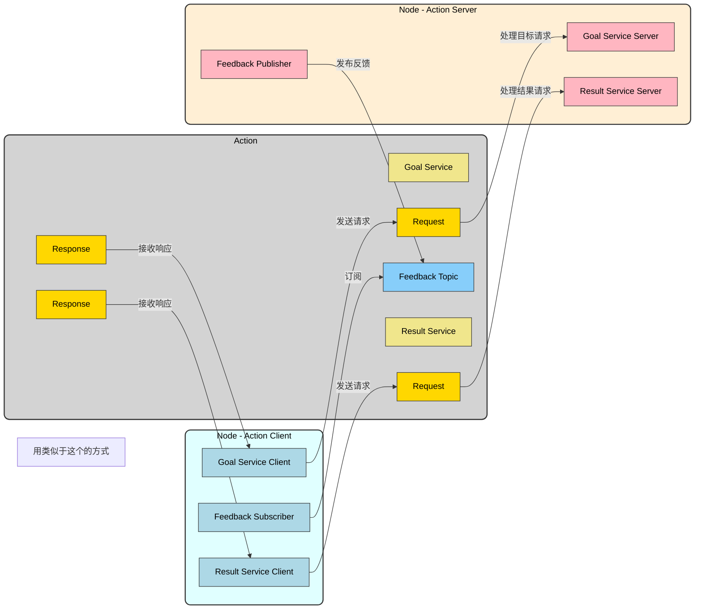
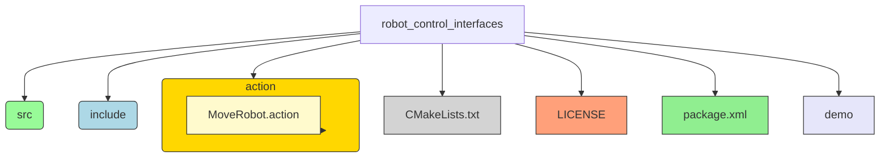
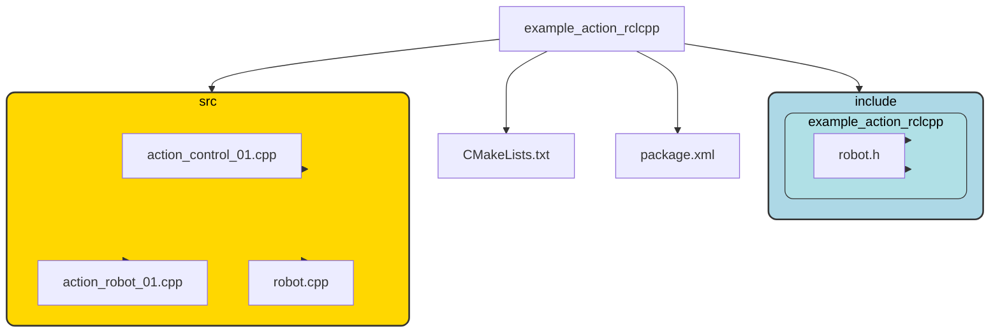
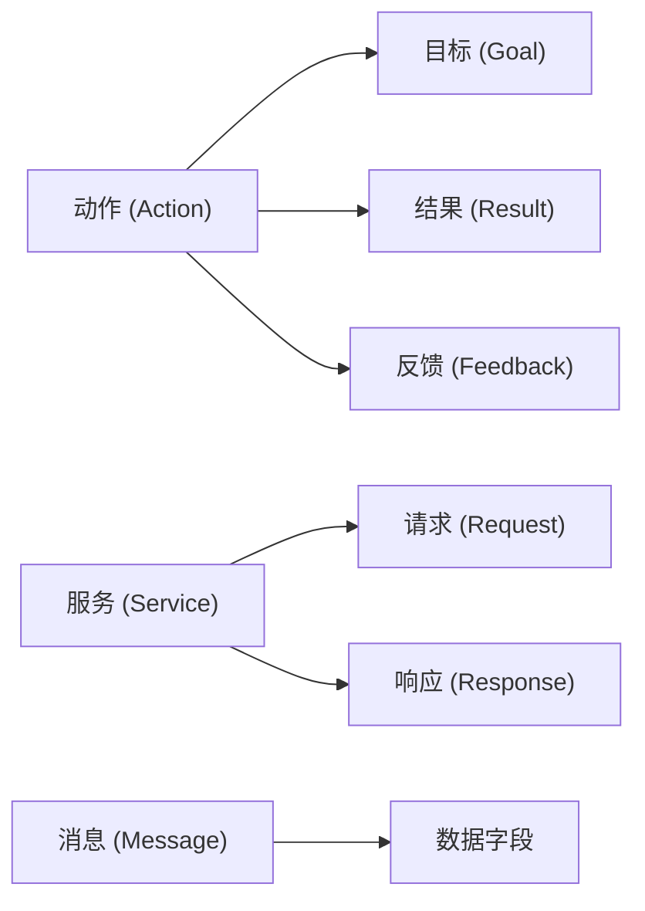
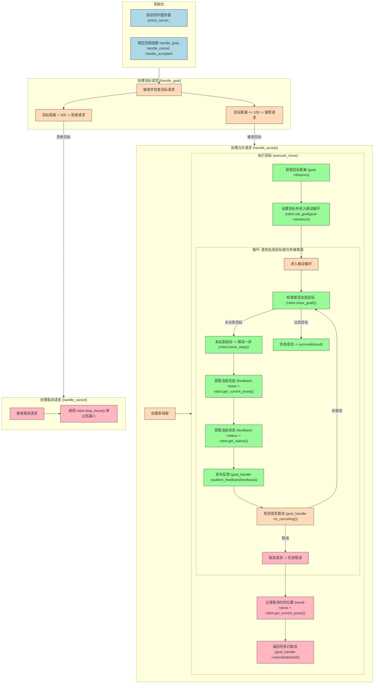
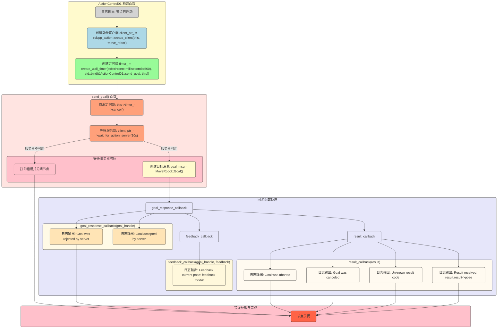

==事先声明==
在typora上做笔记时曾发生过数据丢失的问题，同时在转传到csdn上的时候也有轻微的问题，图片以及mermaid图。如果看的不够清晰可以留言，我将视情况提供原版markdown文件。
==一些建议==

- 请在阅读这份笔记时充分利用**目录**
- 本笔记包含非常多**拓展内容**和**衍生知识**，你可以先阅读重要内容，再阅读这些**其他内容**，当然，充分了解这些内容是很有必要的，它们能帮助你了解这个对象和方法来源于哪里，我将如何使用它们.
- 本文基于**markdown**，你可以拷贝他们到自己的阅读器上，使用查找功能定位功能的表述部分(一般，我在介绍过一次之后不会再重复完整地提及，比如说`GoalHandleMoveRobot`)
- 充分利用`mermaid`图表，这是我倾注心血最多的地方.

- 尽量结合官方文档，本文可能含有错漏之处，请指出！


==支持文档与教程==

- [[ros 2 documentation] 编写动作服务器和客户端 (c ++) 待校准@6753](http://dev.ros2.fishros.com/calibpage/#/home?msgid=6753)
- [[fishros] 动作（Action）通信与自定义接口](https://fishros.com/d2lros2/#/humble/chapt4/get_started/4.动作（Action）通信与自定义接口?id=_4动作（action）通信与自定义接口)
- [[古月居] 古月·ROS2入门21讲 | 带你认识一个全新的机器人操作系统](https://www.bilibili.com/video/BV16B4y1Q7jQ?spm_id_from=333.788.videopod.episodes&vd_source=70726c0c4e3073ec08e9566e626253af&p=11)
- [Mermaid(1)流程图(flowcharts)使用详解](https://zhuanlan.zhihu.com/p/683460723)
- [Developing a ROS 2 package](http://docs.ros.org/en/foxy/How-To-Guides/Developing-a-ROS-2-Package.html)
- [【CMake】CMakeLists.txt的超傻瓜手把手教程（附实例源码）](https://blog.csdn.net/qq_38410730/article/details/102477162)

==官方文档==

- [ros2_api](https://docs.ros2.org/latest/api)
- [rclcpp master](https://docs.ros2.org/latest/api/rclcpp/)

- [rclcpp_action master](https://docs.ros2.org/latest/api/rclcpp_action/)


[TOC]

# 动作(action)是什么？
## action背景

- 话题：适用于节点间单向的、频繁的传输
- 服务：适用于节点间的双向的数据传输
- 参数：用于动态调整节点的设置
- 动作：智能地进行某一项复杂的任务（话题和服务的融合，同时可添加一些参数）

==更详细点==


我们在实际的机器人运动中。当我们希望控制机器人从一个出发点移动到一个重点，会存在以下的问题:

1. 你不知道机器人有没有处理移动到目标点的请求（不清楚服务端是否接收到了信号，同时进行处理）
2. 假设机器人收到了请求，但是你不知道机器人此时的位置和距离目标点的距离（没有反馈）
   - 我们之后可以基于反馈，添加更多的逻辑，譬如说躲避障碍

3. 假设机器人移动了一半，你想让机器人停下来，也没有办法通知机器人(单线程的服务，会阻塞程序的进行，此时我们要加入多线程)


**更多的例子**： 

- 控制导航程序，控制机械臂运动、控制小海龟旋转

## action组成

**Action**的三大组成部分：==目标==、==反馈==、==结果==

- 目标：**Client**告诉**Server** 需要做什么，**Server**需要对请求有响应，解决了通信问题
- 反馈：**Server**告诉**Client** 此时进度如何，解决了没有反馈的问题
- 结果：**Server**告诉**Client** 执行结果，结果最后从**Client**输出，用于表示任务的最终结果

### 话题、服务、参数、动作之间的关系

你可以这么认为

	==话题和服务是构成完整节点的基石==

- 参数是有服务构建出来的
- 动作是由话题和服务构建出来的


**==一个动作 = 三个服务+两个话题==**

- 服务
  1. 目标传递服务
  2. 结果传递服务
  3. 取消执行服务

- 话题
  1. 反馈话题(服务发布、客户端订阅)
  2. 状态话题(服务端发布、客户端订阅)

## 开始启动

### 程序结构

- 自定义通信接口   **==`robot_control_interfaces`==**



- 机器人节点 **==`example_action_rclcpp`==**



**==在`example_action_rclcpp`中包含的其他依赖==**

1. rclcpp_action                       `rclcpp_action/rclcpp_action.hpp`
2. rclcpp			                `rclcpp/rclcpp.h`
---
# 接口的建立

## 包的建立

**使用下列命令来在chapt4_ws/src中建立自定义接口**

```bash
cd chapt4_ws/
ros2 pkg create robot_control_interfaces --build-type ament_cmake --destination-directory src --maintainer-name "fishros" --maintainer-email "fishros@foxmail.com" --license Apache-2.0 --dependencies rosidl_default_generators

```

### 包建立的一般格式

```bash
ros2 pkg create <package_name> \
--build-type <build_type> \
--dependencies <dependency1> <dependency2> ... \
--destination-directory <directory> \
--node-name <node_name> \
--maintainer-name "<maintainer_name>" \
--maintainer-email "<maintainer_email>" \
--license <license_type> \
--description "<description>" \
--version <version> \
--url <url>
```

#### 参数详细说明

1. **`<package_name>`**  
   包名称。作为 ROS 2 中的唯一标识符。

2. **`--build-type <build_type>`**  
   指定包的构建系统类型。

   - `ament_cmake`：C++ 项目使用。
   - `ament_python`：Python 项目使用。

3. **`--dependencies <dependency1> <dependency2> ...`**  
   包的依赖项列表，用空格分隔。常用依赖：

   - `rclcpp`：C++ 客户端库。
   - `rclpy`：Python 客户端库。
   - `std_msgs`：标准消息包。
   - `sensor_msgs`：传感器消息包。

4. **`--destination-directory <directory>`**  
   新包的创建目录。通常为工作空间的 `src` 目录。

5. **`--node-name <node_name>`**  
   创建一个基础节点的源文件，文件名称与节点名称相同。适用于 C++ 和 Python。

6. **`--maintainer-name "<maintainer_name>"`**  
   指定维护者姓名，将记录在 `package.xml` 文件中。

7. **`--maintainer-email "<maintainer_email>"`**  
   指定维护者的电子邮箱地址，用于联系维护者。

8. **`--license <license_type>`**  
   指定开源协议。常见的协议类型：

   - `Apache-2.0`：Apache 许可证 2.0。
   - `MIT`：MIT 许可证。
   - `BSD-3-Clause`：BSD 3-Clause 许可证。
   - `GPL-3.0`：GNU General Public License v3.0。

   例如：

   ```bash
   --license Apache-2.0
   ```

9. **`--description "<description>"`**  
   包的描述信息，简要说明包的用途和功能。该描述将出现在 `package.xml` 中的 `<description>` 标签中。

   例如：

   ```bash
   --description "This package demonstrates parameter handling in ROS 2."
   ```

10. **`--version <version>`**  
    指定包的版本号。默认版本为 `0.0.0`，可以通过此参数自定义。

    ```bash
    --version 1.0.0
    ```

11. **`--url <url>`**  
    为包指定一个相关网址。

    例如：

    ```bash
    --url "https://github.com/username/repo_name" \
    --url "https://docs.example.com"
    ```

#### 示例命令

以下是一个包含所有常用参数的示例命令：

```bash
ros2 pkg create example_parameters_rclcpp \
--build-type ament_cmake \
--dependencies rclcpp std_msgs sensor_msgs \
--destination-directory src \
--node-name parameters_basic \
--maintainer-name "John Doe" \
--maintainer-email "johndoe@example.com" \
--license Apache-2.0 \
--description "This package demonstrates parameter handling in ROS 2." \
--version 1.0.0 \
--url "https://github.com/johndoe/example_parameters_rclcpp" \
--url "https://johndoe.github.io/docs"
```

#### 生成内容概述

运行上述命令后，ROS 2 将在**指定目录**中生成一个名为 `example_parameters_rclcpp` 的包，并自动包含以下内容：

- **`package.xml`**  
  包含包的元数据信息，如包名称、版本、维护者、开源协议、依赖、描述和网址。

- **`CMakeLists.txt`**  
  配置文件，用于 C++ 项目的构建，包括依赖链接等。

- **`parameters_basic.cpp`**  
  基本的 ROS 2 节点源文件，用于快速启动开发。

- **其他文件**  
  包的标准结构文件，如 `include` 和 `src` 文件夹（如果为 C++ 项目），`launch` 文件夹（用于存放启动文件）等。

### 创建接口文件


```bash
mkdir -p src/robot_control_interfaces/action
touch src/robot_control_interfaces/action/MoveRobot.action
```

==我通常在vscode中建立==

## MoveRobot.action

```cpp
#MoveRobot.action   robot_control_interfaces/action
# Goal: 要移动的距离
float32 distance
---
# Result: 最终的位置
float32 pose
---
# Feedback: 中间反馈的位置和状态
float32 pose
uint32 status
uint32 STATUS_MOVING = 3
uint32 STATUS_STOP = 4
```

## packages.xml

确保有（不过我已经在包建立时做好了）

```bash
  <depend>rosidl_default_generators</depend>
  <member_of_group>rosidl_interface_packages</member_of_group>
```

## CMakeLists.tst

确保有（不过我已经在包建立时做好了）

```bash
find_package(ament_cmake REQUIRED)
find_package(rosidl_default_generators REQUIRED)

rosidl_generate_interfaces(${PROJECT_NAME}
  "action/MoveRobot.action"
)
```

## 确认没有问题

在`chapt4_sw`上执行

```bash
colcon build --packages-select robot_control_interfaces
```

## 不同接口的类型

==rosidl==将根据顺序来识别结构体

使用

```
---
```

分割为不同部分。


比如说当我们执行

```cpp
std::shared_ptr<const MoveRobot::Goal> goal  //MoveRobot是我们的action结构
```

就会自动识别`Goal`

```bash
# Goal: 要移动的距离
float32 distance
```

`goal`这个结构体对象中包含一个`distance`的`foat32`类型变量

也就是说，`MoveRobot`这个`action`接口，第一部分是`Goal`，第二部分是`Result`，第三部分是`Feedback`  --使用注释只是让你明白，`rosidl`并不识别注释。



==特别一提的是==

- **动作**和**服务**的调用类似于`std::shared_ptr<const MoveRobot::Goal> `，`MoveRobot`是整一个`action`文件，`Goal`是包含在这个文件里面的结构体。
- **消息**的调用类似于`std::shared_ptr<example_interfaces::msg::PositionVelocity>`，`PositionVelocity`是一整个`msg`文件，一个`msg`文件对应一个主消息类型，但是它可以引用其他的msg文件，实现嵌套的效果。

---
# 机器人节点的定义

## 建立包

pkg包的建立（同时建立了action_robot_01）:

```bash
cd chapt4_ws/
ros2 pkg create example_action_rclcpp --build-type ament_cmake --dependencies rclcpp rclcpp_action robot_control_interfaces --destination-directory src --node-name action_robot_01 --maintainer-name "fishros" --maintainer-email "fishros@foxmail.com" --license Apache-2.0
```

节点及头文件的建立：

```bash
touch src/example_action_rclcpp/src/action_control_01.cpp
touch src/example_action_rclcpp/include/example_action_rclcpp/robot.h
touch src/example_action_rclcpp/src/robot.cpp
```

## 机器人节点的结构


- `robot.h`用于**声明**基本的数据成员和函数方法
- `robot.cpp`用于**定义**在`robot.h`中的函数方法
- `action_robot_01.cpp`实现了机器人的**服务端** --SERVER
- `action_control_01.cpp`实现了机器人的**客户端** --CLIENT
---

# package.xml

```bash
<?xml version="1.0"?>
<?xml-model href="http://download.ros.org/schema/package_format3.xsd" schematypens="http://www.w3.org/2001/XMLSchema"?>
<package format="3">
  <!-- 包名 -->
  <name>example_action_rclcpp</name>
  
  <!-- 版本号 -->
  <version>0.0.0</version>
  
  <!-- 包描述 -->
  <description>TODO: Package description</description>
  
  <!-- 维护者信息 -->
  <maintainer email="fishros@foxmail.com">fishros</maintainer>
  
  <!-- 许可证 -->
  <license>Apache-2.0</license>

  <!-- 构建工具依赖 -->
  <buildtool_depend>ament_cmake</buildtool_depend>

  <!-- 运行时依赖 -->
  <depend>rclcpp</depend>
  <depend>rclcpp_action</depend>
  <depend>robot_control_interfaces</depend>

  <!-- 测试依赖 -->
  <test_depend>ament_lint_auto</test_depend>
  <test_depend>ament_lint_common</test_depend>

  <!-- 导出信息 -->
  <export>
    <build_type>ament_cmake</build_type>
  </export>
</package>

```

==重点放在运行时的依赖上==

---
# CMakelists

```bash
// robot
find_package(ament_cmake REQUIRED)
find_package(rclcpp REQUIRED)
find_package(robot_control_interfaces REQUIRED)
find_package(example_interfaces REQUIRED)
find_package(rclcpp_action REQUIRED)

# action_robot节点

add_executable(action_robot_01 
    src/robot.cpp
    src/action_robot_01.cpp
)
target_include_directories(action_robot_01 PUBLIC
  $<BUILD_INTERFACE:${CMAKE_CURRENT_SOURCE_DIR}/include>
  $<INSTALL_INTERFACE:include>)
target_compile_features(action_robot_01 PUBLIC c_std_99 cxx_std_17)  # Require C99 and C++17
ament_target_dependencies(
  action_robot_01
  "rclcpp"
  "rclcpp_action"
  "robot_control_interfaces"
  "example_interfaces"
)

install(TARGETS action_robot_01
  DESTINATION lib/${PROJECT_NAME})

# action_control节点

add_executable(action_control_01 
  src/action_control_01.cpp
)
target_include_directories(action_control_01 PUBLIC
$<BUILD_INTERFACE:${CMAKE_CURRENT_SOURCE_DIR}/include>
$<INSTALL_INTERFACE:include>)
target_compile_features(action_control_01 PUBLIC c_std_99 cxx_std_17)  # Require C99 and C++17
ament_target_dependencies(
  action_control_01
  "rclcpp"
  "rclcpp_action"
  "robot_control_interfaces"
  "example_interfaces"
)

install(TARGETS action_control_01
DESTINATION lib/${PROJECT_NAME})
```

## finds_packages()

**提供名字以找到整个程序所需要依赖的核心包**

### 使用 `find_package`

`find_package` 命令的基本语法如下：

```cmake
find_package(<PackageName> [version] [REQUIRED] [COMPONENTS components...])
```

- `<PackageName>`：要查找的包名称（例如 `rclcpp`、`ament_cmake`、`Boost` 等）。
- `[version]`：指定的包的最低版本号（可选）。
- `[REQUIRED]`：如果指定，表示这个包是必须的，找不到则停止配置过程并报错。
- `[COMPONENTS components...]`：指定包中的特定组件（可选）。

### 本例中的依赖包与核心包

```cmake
find_package(ament_cmake REQUIRED)
find_package(rclcpp REQUIRED)
find_package(robot_control_interfaces REQUIRED)
find_package(example_interfaces REQUIRED)
find_package(rclcpp_action REQUIRED)
```

### 解释

- `find_package(ament_cmake REQUIRED)`：查找 `ament_cmake` 包。
- `find_package(rclcpp REQUIRED)`：查找 ROS 2 的 C++ 库 `rclcpp`，用于编写 ROS 2 节点。
- `find_package(robot_control_interfaces REQUIRED)`：查找 `robot_control_interfaces` 包，这是我们的自定义接口，包含了 `MoveRobot.action`。
- `find_package(example_interfaces REQUIRED)`：查找 ROS 2 中的 `example_interfaces` 包，它提供了一些基本的接口。
- `find_package(rclcpp_action REQUIRED)`：查找 `rclcpp_action` 包，用于支持 ROS 2 中的 action 功能。

### `find_package` 的工作原理

- CMake 会在系统的默认路径和 `CMAKE_PREFIX_PATH` 中搜索所需的包。如果找到符合条件的包，会加载其配置文件（例如，`<PackageName>Config.cmake` 或 `<package>.cmake`）。
- 一旦找到并加载了包的配置文件，CMake 就知道如何包含和链接该包的头文件和库文件。


### `add_executable`

在 CMake 构建系统中，`add_executable` 用于定义一个可执行文件，并指定它的源文件。

```cmake
# action_robot_01 节点
add_executable(action_robot_01 
    src/robot.cpp
    src/action_robot_01.cpp
)
```

#### 解释每一部分

1. **`add_executable`**：

   - `add_executable` 是 CMake 的一个指令，用于定义一个可执行目标（即最终生成的可执行文件）。
   - 语法：`add_executable(<name> [sources...])`，其中 `<name>` 是可执行文件的名称，`[sources...]` 是该可执行文件所需的源文件列表。

2. **`action_robot_01`**：

   - 这是要生成的可执行文件的名称。在编译后，会生成一个名为 `action_robot_01` 的可执行文件。
   - 在执行 `make` 编译后，生成的可执行文件路径通常位于 `build` 文件夹中的指定位置（例如 `build/<project_name>/action_robot_01`）。

3. **`src/robot.cpp`** 和 **`src/action_robot_01.cpp`**：

   - 这些是组成 `action_robot_01` 可执行文件的源文件。

   - `src/robot.cpp` 和 `src/action_robot_01.cpp` 会被一起编译并链接，以生成 `action_robot_01`。

   - CMake 会将这些源文件一起编译，然后将编译出的目标对象文件链接成一个单一的可执行文件 `action_robot_01`。

     

==也就是说，`action_robot_01`需要`src/robot.cpp` 和 `src/action_robot_01.cpp`这两个依赖。==

在生成`action_robot_01`节点时，会同时执行`src/robot.cpp` 


## target_include_directories()

在 CMake 中，`target_include_directories` 用于为指定的目标（例如可执行文件或库）设置头文件的包含路径。通过 `target_include_directories` 命令，就可以确保在编译目标时，编译器能够找到它所依赖的头文件哩。

### 基本语法

```cmake
target_include_directories(<target> <INTERFACE|PUBLIC|PRIVATE> [directories...])
```

- `<target>`：目标名称，例如可执行文件或库的名称。
- `<INTERFACE|PUBLIC|PRIVATE>`：可见性修饰符，决定包含目录的可见性：
  - **PRIVATE**：只有当前目标能用这些头文件，别人不能用。
  - **INTERFACE**：当前目标不用这些头文件，但它的依赖目标可以用。
  - **PUBLIC**：当前目标和依赖它的其他目标都可以用这些头文件。
- `[directories...]`：一个或多个包含目录的路径。

### 示例

```cmake
target_include_directories(action_robot_01 PUBLIC
  $<BUILD_INTERFACE:${CMAKE_CURRENT_SOURCE_DIR}/include>
  $<INSTALL_INTERFACE:include>)
```

在该示例中：

- `action_robot_01` 是目标名。
- `PUBLIC` 关键字表示包含目录在 `action_robot_01` 目标和依赖该目标的其他目标中都可见。
- `$<BUILD_INTERFACE:${CMAKE_CURRENT_SOURCE_DIR}/include>`：在构建时使用 `${CMAKE_CURRENT_SOURCE_DIR}/include` 作为包含路径。

  1. `CMAKE_SOURCE_DIR`：始终指向项目的根目录 `chapt4_ws`，在任何子目录中都不变。

  2. `CMAKE_CURRENT_SOURCE_DIR`：指向当前处理的 `CMakeLists.txt` 所在的目录。例如在 `example_action_rclcpp` 的 `CMakeLists.txt` 中，它指向`chapt4/src/example_action_rclcpp`。

  3. `CMAKE_CURRENT_BINARY_DIR`：指向当前目录在构建目录下的对应路径。例如在 `example_action_rclcpp` 的 `CMakeLists.txt` 中，它指向 `chapt4/build/src/example_action_rclcpp`。
- `$<INSTALL_INTERFACE:include>`：在安装后使用 `include` 目录作为包含路径。

## target_compile_features()

指定 C++ 或 C 的特定标准版本

## ament_target_dependencies()

```bash
ament_target_dependencies(
  action_robot_01
  "rclcpp"
  
  "rclcpp_action"
  "robot_control_interfaces"
  "example_interfaces"
)
```

此命令将 `"rclcpp"  "rclcpp_action"  "robot_control_interfaces" "example_interfaces"`的包含路径、库链接等自动添加到 `action_robot_01`，确保正确编译和链接。

## install()

在 CMake 中，`install` 命令用于指定安装目标文件的位置，将编译后的文件放入指定的安装目录。

```bash
install(TARGETS action_robot_01
  DESTINATION lib/${PROJECT_NAME})
```

- `action_robot_01`：要安装的目标，例如可执行文件或库。
- `DESTINATION <path>`：指定目标文件的安装路径，通常是相对于安装根目录的路径。
- `${PROJECT_NAME}` 是项目名称变量。

---
# robot.h

```cpp
/*
copyright
*/
#ifndef EXAMPLE_ACTION_RCLCPP_ROBOT_H_
#define EXAMPLE_ACTION_RCLCPP_ROBOT_H_
#include "rclcpp/rclcpp.hpp"
#include "robot_control_interfaces/action/move_robot.hpp"

class Robot {
   public:
    using MoveRobot = robot_control_interfaces::action::MoveRobot;
    Robot() = default;
    ~Robot() = default;
    float move_step();              // 移动一小步，间隔500ms一次
    bool set_goal(float distance);  // 移动一段举例
    float get_current_pose();
    int get_status();
    bool close_goal();  //是否接近目标
    void stop_move();   //停止移动

   private:
    float current_pose_ = 0.0;              //声明当前位置
    float target_pose_ = 0.0;               //目标位置
    float move_distance_ = 0.0;             //目标距离
    std::atomic<bool> cancel_flag_{false};  //取消标志
    int status_ = MoveRobot::Feedback::STATUS_STOP;
};
#endif  // EXAMPLE_ACTION_RCLCPP_ROBOT_H_
```

## 数据成员和变量

### 公有成员函数

这些成员函数提供了 `Robot` 类的主要功能接口：

1. **`move_step()`**：移动一小步，间隔 500ms。
   - 类型：`float`
   - 功能：根据 `move_distance_` 设置的方向和目标，更新当前位置 `current_pose_` 并返回新位置。

2. **`set_goal(float distance)`**：设置目标位置。
   - 类型：`bool`
   - 参数：`float distance`（要移动的目标距离）
   - 功能：将目标距离设置为 `move_distance_`，更新 `target_pose_`。如果接近目标位置，则设置 `status_` 为 `STATUS_STOP`，否则为 `STATUS_MOVING`。

3. **`get_current_pose()`**：获取当前的机器人位置。
   - 类型：`float`
   - 功能：返回 `current_pose_`，即机器人当前位置。

4. **`get_status()`**：获取当前移动状态。
   - 类型：`int`
   - 功能：返回 `status_`，表示当前的机器人状态（`STATUS_MOVING` 或 `STATUS_STOP`）。

5. **`close_goal()`**：判断是否接近目标。
   - 类型：`bool`
   - 功能：检查当前位置 `current_pose_` 与目标位置 `target_pose_` 之间的距离是否小于 0.01，用于判断是否接近目标位置。

6. **`stop_move()`**：停止机器人移动。
   - 类型：`void`
   - 功能：将 `status_` 设置为 `STATUS_STOP`。

### 私有数据成员

这些数据成员用于存储机器人的内部状态：

1. **`float current_pose_`**：当前位置。

   - 初始值：`0.0`
   - 功能：用于记录机器人当前的位置信息。

2. **`float target_pose_`**：目标位置。

   - 初始值：`0.0`
   - 功能：表示机器人需要到达的目标位置。

3. **`float move_distance_`**：目标距离。

   - 初始值：`0.0`
   - 功能：表示机器人从当前位置到目标位置的总距离。

4. **`std::atomic<bool> cancel_flag_`**：取消标志。

   - 初始值：`false`
   - 功能：用于标记是否取消当前移动操作，以支持线程安全的取消操作。

5. **`int status_`**：移动状态。

   - 初始值：`MoveRobot::Feedback::STATUS_STOP`
   - 功能：表示机器人的当前状态，可能的值包括 `STATUS_MOVING`（正在移动）和 `STATUS_STOP`（停止）。

   ```mermaid
   flowchart LR
       A["Robot"]:::main
   
       A --> Z["私有数据成员"]:::subgroup
       Z --> B["current_pose_ : float (当前位置)"]:::data
       Z --> C["target_pose_ : float (目标位置)"]:::data
       Z --> D["move_distance_ : float (移动距离)"]:::data
       Z --> E["cancel_flag_ : std::atomic<bool> (取消标志)"]:::data
       Z --> F["status_ : int (状态)"]:::data
   
       A --> Y["公有方法"]:::subgroup
       Y --> G["move_step() : float - 移动一小步"]:::method
       Y --> H["set_goal(distance : float) : bool - 设置目标"]:::method
       Y --> I["get_current_pose() : float - 获取当前位置"]:::method
       Y --> J["get_status() : int - 获取状态"]:::method
       Y --> K["close_goal() : bool - 检查接近目标"]:::method
       Y --> L["stop_move() : void - 停止移动"]:::method
       
       %% MoveRobot 状态别名
       subgraph MoveRobot ["MoveRobot::Feedback 状态"]
           M["STATUS_STOP"]
           N["STATUS_MOVING"]
           M -->|开始移动| N  
           N -->|停止| M      
       end
   
       %% 使用 style 指令为每个节点单独设置样式
       style MoveRobot fill:#E6E6FA,stroke:#333,stroke-width:1.5px,color:#333;
       style M fill:#FFFACD,stroke:#333,stroke-width:1px,color:#333;
       style N fill:#FFFACD,stroke:#333,stroke-width:1px,color:#333;
   
       F -->|状态常量| MoveRobot
       H -->|设置状态| F
       L -->|设置为停止状态| F
   
       classDef main fill:#FFD700,stroke:#333,stroke-width:2px,rx:5px,ry:5px,color:#333;
       classDef subgroup fill:#ADD8E6,stroke:#333,stroke-width:1.5px,rx:5px,ry:5px,color:#333;
       classDef data fill:#FFA07A,stroke:#333,stroke-width:1px,color:#333;
       classDef method fill:#98FB98,stroke:#333,stroke-width:1px,color:#333;
       classDef statusVal fill:#FFFACD,stroke:#333,stroke-width:1px,color:#333;
   
   ```


## `#ifndef` 和 `#define` ?

在 C++ 中，`#ifndef` 和 `#define` 宏通常用于**防止头文件被多次包含**。这种写法被称为“**包含保护**”（Include Guard），可以确保头文件的内容在一个编译单元中只被包含一次，避免重复定义带来的编译错误。

### 解释

1. **`#ifndef EXAMPLE_ACTION_RCLCPP_ROBOT_H_`**：
   - `#ifndef` 是“if not defined”的缩写，意思是“如果未定义”。
   - `EXAMPLE_ACTION_RCLCPP_ROBOT_H_` 是一个预处理器宏的名称.
   - 如果该宏尚未定义（即此文件是第一次被包含），则执行下面的内容。

2. **`#define EXAMPLE_ACTION_RCLCPP_ROBOT_H_`**：
   - `#define` 指令将 `EXAMPLE_ACTION_RCLCPP_ROBOT_H_` 定义为一个宏。
   - 一旦这个宏被定义，后续任何对这个头文件的包含都会发现 `EXAMPLE_ACTION_RCLCPP_ROBOT_H_` 已经定义了，因此会跳过整个头文件的内容，不再重复包含。

3. **`#endif`**：
   - `#endif` 与 `#ifndef` 相对应，用于结束这个条件编译的块。

### 执行流程

- **第一次包含**：
  - 如果这个文件第一次被包含，`EXAMPLE_ACTION_RCLCPP_ROBOT_H_` 尚未定义。
  - `#ifndef EXAMPLE_ACTION_RCLCPP_ROBOT_H_` 的条件为==TRUE==，因此会定义 `EXAMPLE_ACTION_RCLCPP_ROBOT_H_` 并执行文件中的内容。

- **再次包含**：
  - 如果该文件再次被包含，`EXAMPLE_ACTION_RCLCPP_ROBOT_H_` 已经定义。
  - `#ifndef EXAMPLE_ACTION_RCLCPP_ROBOT_H_` 的条件为==FALSE==，文件内容会被跳过，不会被再次包含。

## std::atomic

**==官方文档==**:

- ["std::atomic"](https://en.cppreference.com/w/cpp/atomic/atomic)

```cpp
std::atomic<bool> cancel_flag_{false};  // 取消标志
```

`std::atomic<bool>` 是 C++ 标准库中的一种**原子类型**，用于在**多线程**环境中安全地操作布尔值 `cancel_flag_`。

### 解释

1. **`std::atomic<bool>`**：

   - `std::atomic` 是一个模板类，它可以包装一个数据类型（在这里是 `bool`），使其在多线程环境中操作时是“原子性”的。
   - **原子性**指的是，变量的操作不会被其他线程中断。对原子变量的读写操作在硬件级别是不可分割的，因此不会出现多个线程同时访问时的数据竞争问题。
   - 使用 `std::atomic<bool>` 确保了 `cancel_flag_` 的读写操作在多线程环境中是安全的，不会因为竞争条件而出现错误的状态。

2. **`cancel_flag_`**：

   - 这是一个标志变量，通常用于**通知某个操作或线程应该停止**。
   - 例如，机器人正在执行某个动作，如果外部请求取消操作，`cancel_flag_` 可以被设置为 `true`，其他线程会检测到这个标志并停止动作。

   

### 典型

在机器人控制系统或多线程应用中，`cancel_flag_` 通常用于实现**安全的取消操作**。例如，假设有一个机器人正在执行一个移动任务，当任务开始时，`cancel_flag_` 为 `false`，表示正常执行。某一时刻，主线程或外部控制器可能会发出取消指令，这时可以将 `cancel_flag_` 设置为 `true`，执行任务的线程会检测到这个标志并停止任务。

### 总结

- `std::atomic<bool> cancel_flag_{false};` 是一个线程安全的布尔标志，初始为 `false`。
- 在需要取消操作时，可以将其设置为 `true`，其他线程会检测到这一状态并终止相应操作。
- 这是多线程编程中的一种常用方法，用于实现线程间的安全状态传递。

## MoveRobot::Feedback::STATUS_STOP

在这行代码中：

```cpp
int status_ = MoveRobot::Feedback::STATUS_STOP;
```

### 解释

在接口中定义的==(这里推荐你保存，之后会有很多相互调用的地方)==

```cpp
#MoveRobot.action   robot_control_interfaces/action
# Feedback: 中间反馈的位置和状态
float32 pose
uint32 status
uint32 STATUS_MOVING = 3
uint32 STATUS_STOP = 4
```


这里的 `MoveRobot::Feedback::STATUS_STOP` 表示一个枚举值或常量，用于指示机器人当前的**状态**。具体含义如下：

1. **`MoveRobot`**：
   - `MoveRobot` 是一个定义在 `robot_control_interfaces::action` 命名空间中的 Action 接口（action 文件）
2. **`Feedback`**：
   - `Feedback` 是 `MoveRobot` 定义的一个嵌套类型（通常是一个结构体），用于传递动作执行过程中的反馈信息。（这是由rosidl自动生成的）
3. **`STATUS_STOP`**：
   - `STATUS_STOP` 是 `MoveRobot::Feedback` 中定义的一个**状态常量**或**枚举值**，用于表示机器人当前处于“停止”状态。

### 具体作用

将 `status_` 变量初始化为 `MoveRobot::Feedback::STATUS_STOP` 表示机器人一开始处于“停止”状态。

**状态转换包括**：

- 从 `STATUS_STOP` 转变为 `STATUS_MOVING`（机器人开始移动）。
- 从 `STATUS_RUNNING` 转变为 `STATUS_STOP`（机器人到达目标或收到停止命令）。

==具体实现的定义将在robot.h中被完善==

---
# Robot.cpp

```cpp
// Robot.cpp
#include "example_action_rclcpp/robot.h"

//移动一小步，500ms一次
float Robot::move_step() {
    //每一步移动到 当前到目标举例的 1/10
    int direct = move_distance_ / fabs(move_distance_);
    float step = direct * fabs(target_pose_ - current_pose_) * 0.1;

    current_pose_ += step;
    std::cout << "移动: " << step << " 当前位置: " << current_pose_ << std::endl;
    return current_pose_;
}

//移动一段距离
bool Robot::set_goal(float distance) {
    move_distance_ = distance;
    target_pose_ += move_distance_;

    //当目标距离和当前距离大于0.1 ，同意想目标移动
    if (close_goal()) {
        status_ = MoveRobot::Feedback::STATUS_STOP;
        return false;
    }
    status_ = MoveRobot::Feedback::STATUS_MOVING;
    return true;
}

float Robot::get_current_pose() { return current_pose_; }
int Robot::get_status() { return status_; }

bool Robot::close_goal() { return fabs(target_pose_ - current_pose_) < 0.01; }
void Robot::stop_move() { status_ = MoveRobot::Feedback::STATUS_STOP; }

```

这是 `Robot` 类的实现代码，用于模拟机器人移动。

即定义了在`Robot.h`中声明的方法。

## 1. `move_step()`

```cpp
float Robot::move_step() {
    int direct = move_distance_ / fabs(move_distance_);
    float step = direct * fabs(target_pose_ - current_pose_) * 0.1;

    current_pose_ += step;
    std::cout << "移动: " << step << " 当前位置: " << current_pose_ << std::endl;
    return current_pose_;
}
```

- **功能**：让机器人每次向目标位置移动一小步。移动的步长是距离目标位置的 `1/10`，并且方向由 `move_distance_`==(Robot类的私有数据成员)== 确定。
- **返回值**：返回当前的 `current_pose_`。

## 2. `set_goal(float distance)`

```cpp
bool Robot::set_goal(float distance) {
    move_distance_ = distance;
    target_pose_ += move_distance_;

    if (close_goal()) {
        status_ = MoveRobot::Feedback::STATUS_STOP;
        return false;
    }
    status_ = MoveRobot::Feedback::STATUS_MOVING;
    return true;
}
```

- **功能**：设定机器人移动的目标位置。调用此函数时，`move_distance_` 被设为目标距离，`target_pose_` 被更新。
- **逻辑**：如果机器人已经接近目标（通过 `close_goal()` 检查），则设置状态为 `STATUS_STOP` 并返回 `false`；否则，设置状态为 `STATUS_MOVING` 并返回 `true`。

## 3. `get_current_pose()`

```cpp
float Robot::get_current_pose() { return current_pose_; }
```

- **功能**：返回当前的位置 `current_pose_`。

## 4. `get_status()`

```cpp
int Robot::get_status() { return status_; }
```

- **功能**：返回当前的状态 `status_`，状态为 `STATUS_MOVING` 或 `STATUS_STOP`。

## 5. `close_goal()`

```cpp
bool Robot::close_goal() { return fabs(target_pose_ - current_pose_) < 0.01; }
```

- **功能**：检查机器人是否接近目标位置（误差小于 `0.01`）。
- **返回值**：若接近目标位置，返回 `true`；否则返回 `false`。
- `fabs`是取**绝对值**

## 6. `stop_move()`

```cpp
void Robot::stop_move() { status_ = MoveRobot::Feedback::STATUS_STOP; }
```

- **功能**：停止机器人移动，将状态设置为 `STATUS_STOP`。

### 代码功能总结

- `Robot` 类模拟了一个简单的移动机器人。
- 支持设置目标位置、按步移动、检查是否到达目标等操作。
- 通过 `status_` 字段记录机器人的移动状态，反馈当前是否在移动或已停止。

---
# action_robot_01(服务端)

==重头戏==

```c++
#include "example_action_rclcpp/robot.h"
#include "rclcpp/rclcpp.hpp"
#include "rclcpp_action/rclcpp_action.hpp"
#include "robot_control_interfaces/action/move_robot.hpp"

class ActionRobot01 : public rclcpp::Node {
   public:
    using MoveRobot = robot_control_interfaces::action::MoveRobot;
    using GoalHandleMoveRobot = rclcpp_action::ServerGoalHandle<MoveRobot>;

    explicit ActionRobot01(const std::string name) : Node(name) {
        RCLCPP_INFO(this->get_logger(), "节点已启动[%s]", name.c_str());

        using namespace std::placeholders;  // NOLINT

        this->action_server_ = rclcpp_action::create_server<MoveRobot>(
            this,
            "move_robot",
            std::bind(&ActionRobot01::handle_goal, this, _1, _2),
            std::bind(&ActionRobot01::handle_cancel, this, _1),
            std::bind(&ActionRobot01::handle_accepted, this, _1));
    }

   private:
    Robot robot;
    rclcpp_action::Server<MoveRobot>::SharedPtr action_server_;

    // handle_goal
    rclcpp_action::GoalResponse handle_goal(const rclcpp_action::GoalUUID& uuid,
                                            std::shared_ptr<const MoveRobot::Goal> goal) {
        RCLCPP_INFO(this->get_logger(), "Received goal request with distance %f", goal->distance);
        (void)uuid;

        if (std::fabs(goal->distance) > 100) {
            RCLCPP_WARN(this->get_logger(), "目标距离太远了，本机器人表示拒绝!");
            return rclcpp_action::GoalResponse::REJECT;
        }
        RCLCPP_INFO(this->get_logger(),
                    "目标距离%f我可以走到,本机器人接受,准备触发!",
                    goal->distance);
        return rclcpp_action::GoalResponse::ACCEPT_AND_EXECUTE;
    }

    // handle_cancel
    rclcpp_action::CancelResponse handle_cancel(
        const std::shared_ptr<GoalHandleMoveRobot> goal_handle) {
        RCLCPP_INFO(this->get_logger(), "Received request to cancel goal...");
        (void)goal_handle;
        robot.stop_move();
        return rclcpp_action::CancelResponse::ACCEPT;
    }

    // handle_accepted
    void handle_accepted(const std::shared_ptr<GoalHandleMoveRobot> goal_handle) {
        using std::placeholders::_1;
        std::thread{std::bind(&ActionRobot01::execute_move, this, _1), goal_handle}.detach();
    }
    // handle_accepted 的回调函数
    void execute_move(const std::shared_ptr<GoalHandleMoveRobot> goal_handle) {
        const auto goal = goal_handle->get_goal();
        RCLCPP_INFO(this->get_logger(), "开始执行移动 %f...", goal->distance);

        auto result = std::make_shared<MoveRobot::Result>();
        rclcpp::Rate rate = rclcpp::Rate(2);
        robot.set_goal(goal->distance);

        while (rclcpp::ok() && !robot.close_goal()) {
            robot.move_step();
            auto feedback = std::make_shared<MoveRobot::Feedback>();
            feedback->pose = robot.get_current_pose();
            feedback->status = robot.get_status();

            goal_handle->publish_feedback(feedback);
            //检测任务是否被取消
            if (goal_handle->is_canceling()) {
                result->pose = robot.get_current_pose();
                goal_handle->canceled(result);
                RCLCPP_INFO(this->get_logger(), "Goal Canceled");
                return;
            }
            RCLCPP_INFO(this->get_logger(), "Publish Feedback");
            rate.sleep();
        }

        result->pose = robot.get_current_pose();
        goal_handle->succeed(result);
        RCLCPP_INFO(this->get_logger(), "Goal Succeeded");
    }
};

int main(int argc, char** argv) {
    rclcpp::init(argc, argv);
    auto node = std::make_shared<ActionRobot01>("action_robot_01");
    rclcpp::spin(node);
    rclcpp::shutdown();
    return 0;
}
```

---



---

## 教程代码中的一些问题

### handle_goal

==对于距离的处理问题==

```cpp
if (std::fabs(goal->distance) > 100)    //我的
if (std::fabs(goal->distance  > 100)    //教程
```

---

## 一些依赖

使用了 `using` 关键字来为 `MoveRobot` 和 `GoalHandleMoveRobot` 创建别名.

```cpp
using MoveRobot = robot_control_interfaces::action::MoveRobot;
using GoalHandleMoveRobot = rclcpp_action::ServerGoalHandle<MoveRobot>;
```

### 解释

1. **`using MoveRobot = robot_control_interfaces::action::MoveRobot;`**
   - `robot_control_interfaces::action::MoveRobot` 是一个动作接口，它定义了一个 ROS 2 动作，包括目标（goal）、反馈（feedback）和结果（result）的结构。
2. **`using GoalHandleMoveRobot = rclcpp_action::ServerGoalHandle<MoveRobot>;`**
   - `ServerGoalHandle` 是 ROS 2 中的一个模板类，用于表示 Action Server 的目标句柄。目标句柄包含目标的状态和与客户端交互的方法，例如接受、取消和完成目标。

#### `ServerGoalHandle` 的主要功能

`ServerGoalHandle` 提供了多种方法，用于检查目标的状态、发送反馈、处理取消请求等，这些功能在 ROS 2 动作服务器中非常重要。


==现在goal_handle是一个`GoalHandleMoveRobot`类型的智能指针==   即`rclcpp_action::ServerGoalHandle<MoveRobot>`

```cpp
const std::shared_ptr<GoalHandleMoveRobot> goal_handle
```

##### 2.1 状态管理

- ###### **`is_active()`**

  - 用途：检查目标是否处于“活动”状态。

  - 返回值：`true` 表示目标正在被执行；`false` 表示目标已经完成或被取消。

  - 示例：

    ```cpp
    if (goal_handle->is_active()) {
        // 执行一些操作，因为目标仍然活跃
    }
    ```

  - 典型场景：用于在执行任务的过程中确认目标是否仍然有效，避免执行已经完成或取消的目标。

- ###### **`is_canceling()`**

  - 用途：检查目标是否收到取消请求。

  - 返回值：`true` 表示客户端请求取消该目标；`false` 表示没有取消请求。

  - 示例：

    ```cpp
    if (goal_handle->is_canceling()) {
        // 处理取消逻辑，例如停止任务
    }
    ```

  - 典型场景：在执行过程中检测是否有取消请求，若检测到取消，可以执行停止任务的操作并返回取消结果。

##### 2.2 反馈发送`publish_feedback()`**(服务器端专用）**

- ###### **`publish_feedback()`**的**服务端**如何发送反馈

  - 用途：向客户端发送实时反馈信息。

  - 参数：`std::shared_ptr<const T::Feedback>`，这是一个指向反馈消息的共享指针。

  - 示例：

    ```cpp
    auto feedback = std::make_shared<MoveRobot::Feedback>();
    feedback->pose = robot.get_current_pose();
    feedback->status = robot.get_status();
    goal_handle->publish_feedback(feedback);
    ```

  - 典型场景：在任务执行过程中发布当前的进度和状态，帮助客户端了解任务的执行情况，尤其在长时间执行的任务中非常有用。

    - 具体到这一行代码：

    - ```cpp
      goal_handle->publish_feedback(feedback);	
      ```

      - 这里的 `feedback` 是一个指向 `MoveRobot::Feedback` 结构体的智能指针。该结构体包含了机器人当前的位置信息 `pose` 和状态 `status`，用于描述当前任务的执行状态。发布反馈的步骤如下：

    - **生成反馈消息**：在 `execute_move` 函数中，创建并填充 `feedback` 对象，以包含当前的位置信息和状态信息。

    ```cpp
    auto feedback = std::make_shared<MoveRobot::Feedback>();
    feedback->pose = robot.get_current_pose();
    feedback->status = robot.get_status();
    ```

    - `feedback->pose` 是机器人当前位置，表示机器人在执行任务过程中的位置。
    - `feedback->status` 是机器人的状态，例如“移动中”或“停止”。

  - **调用 `publish_feedback` 发送反馈**：填充 `feedback` 数据后，通过 `goal_handle->publish_feedback(feedback);` 发布此反馈。

    - `publish_feedback` 将 `feedback` 消息发送到与客户端相连的反馈主题（feedback topic,这里是`move_robot`）上。
    - 客户端可以订阅此反馈主题，在任务执行过程中不断接收反馈。

  ######  **`publish_feedback()`**的**客户端**如何处理反馈

  客户端在提交目标请求时，可以选择订阅服务器的反馈主题，以便实时跟踪任务的进展。具体过程如下：

  - 客户端在发送任务请求（goal request）后，开始监听服务器的反馈主题。
  - 每当服务器调用 `goal_handle->publish_feedback(feedback);` 发送反馈时，客户端会收到此消息。
  - 客户端可以根据 `feedback` 消息中的 `pose` 和 `status` 信息，实时更新任务状态，例如在界面上显示机器人当前的位置或任务的进展状态。

  ###### 为什么使用 `publish_feedback`

  - **实时性**：`publish_feedback` 使得服务器可以在任务执行期间实时发布反馈信息，而不是等任务完成后一次性返回结果。对于需要较长时间执行的任务（例如导航、路径规划），实时反馈尤为重要。
  - **任务状态监控**：客户端可以随时获取任务的状态，了解任务是否正常进行，或者是否已完成、取消或遇到障碍。
  - **提高交互性**：实时反馈可以增强客户端和服务器之间的交互性，使得客户端能够对任务的执行情况做出响应（例如，提前取消任务或调整任务参数）。

  **举例说明**

  假设一个机器人在执行路径跟随任务，任务包含多个目标点，任务完成需要较长时间。客户端希望实时监控机器人是否到达每个目标点。在这种情况下：

  - `goal_handle->publish_feedback(feedback);` 可以在每次机器人位置发生显著变化（例如每达到一个新目标点）时调用，将当前位置信息发布为反馈。
  - 客户端接收到反馈后，可以在界面上更新机器人的当前位置，显示机器人正在逐步接近最终目标。
  - 如果客户端发现机器人长时间在某个位置未移动（例如遇到障碍物），可以选择取消任务或者重新规划路径。

##### 2.3 结果处理

- ###### **`succeed()`**  **（服务器端专用）**

  - 用途：标记目标成功完成，并向客户端发送成功的结果。

  - 参数：`std::shared_ptr<const T::Result>`，这是一个指向结果消息的共享指针。

  - 示例：

    ```cpp
    auto result = std::make_shared<MoveRobot::Result>();
    result->pose = robot.get_current_pose();
    goal_handle->succeed(result);
    ```

  - 典型场景：当任务顺利完成后调用，将任务的最终结果发送给客户端，标记任务状态为“成功”。

- ###### **`abort()`**     **（服务器端专用）**

  - 用途：标记目标失败，并向客户端发送失败的结果。

  - 参数：`std::shared_ptr<const T::Result>`，这是一个指向结果消息的共享指针。

  - 示例：

    ```cpp
    auto result = std::make_shared<MoveRobot::Result>();
    goal_handle->abort(result);
    ```

  - 典型场景：当任务由于某些原因无法完成时（例如硬件故障或其他限制），调用 `abort()` 来结束任务并通知客户端任务失败。

- ###### **`canceled()`**   **（服务器端专用）**

  - 用途：标记目标已被取消，并向客户端发送取消结果。

  - 参数：`std::shared_ptr<const T::Result>`，这是一个指向结果消息的共享指针。

  - 示例：

    ```cpp
    auto result = std::make_shared<MoveRobot::Result>();
    result->pose = robot.get_current_pose();
    goal_handle->canceled(result);
    ```

  - 典型场景：当客户端请求取消任务时，调用 `canceled()` 来停止任务，并向客户端发送取消的结果。

#### 总结

- **状态检查**：`is_active()` 和 `is_canceling()` 用于判断当前目标的执行状态和是否收到取消请求。
- **反馈发布**：`publish_feedback()` 提供了实时反馈的能力，适合长时间任务。
- **结果处理**：`succeed()`、`abort()` 和 `canceled()` 用于标记目标的最终状态（成功、失败或取消）。

#### 客户端与服务端

- **客户端**：用于跟踪特定目标请求的状态，允许客户端查询状态、接收反馈以及在需要时取消目标。
- **服务端**：用于管理和控制目标请求的整个生命周期，从接收请求到提供反馈、完成或取消目标，帮助服务器实时控制任务的执行和状态管理。

---

## ActionRobot01()构造函数

```cpp
explicit ActionRobot01(const std::string name) : Node(name) {
    RCLCPP::INFO(this->get_logger(), "节点已启动[%s]", name.c_str());

    using namespace std::placeholders;  // NOLINT

    this->action_server_ = rclcpp_action::create_server<MoveRobot>(
        this,
        "move_robot",
        std::bind(&ActionRobot01::handle_goal, this, _1, _2),
        std::bind(&ActionRobot01::handle_cancel, this, _1),
        std::bind(&ActionRobot01::handle_accepted, this, _1));
}
```

### `explicit` 关键字

你应该注意到了，之前并没有这个前缀.

在 C++ 中，`explicit` 关键字用于构造函数的声明，目的是防止编译器在没有显式调用的情况下，自动进行 **隐式转换** 或 **单参数构造函数的隐式调用**。

#### 作用和示例

在没有 `explicit` 的情况下，单参数构造函数可以被用于隐式类型转换。例如，考虑以下代码：

```cpp
class MyClass {
public:
    MyClass(int x) {}  // 单参数构造函数
};

MyClass obj = 5;  // 合法，但这里发生了隐式转换
```

在上面的代码中，编译器会将 `5` 隐式地转换成 `MyClass` 类型对象。这种隐式转换可能会引入一些不易察觉的错误。通过将构造函数声明为 `explicit`，我们可以避免这样的隐式转换：

```cpp
class MyClass {
public:
    explicit MyClass(int x) {}  // 构造函数前加上 explicit
};

MyClass obj = 5;  // 错误：无法进行隐式转换
MyClass obj(5);   // 合法，显式构造
```

在这个例子中，使用 `explicit` 后，`MyClass obj = 5;` 会导致编译错误，必须写成 `MyClass obj(5);`，即必须显式调用构造函数。

#### 在本代码中的作用

```cpp
explicit ActionRobot01(const std::string name) : Node(name) {
    // ...
}
```

这表示 **不允许** 通过隐式转换的方式创建 `ActionRobot01` 对象。例如，以下代码将被禁止：

```cpp
ActionRobot01 robot = "RobotName";  // 错误，因为构造函数是 explicit 的
```

必须显式地构造对象，如下：

```cpp
ActionRobot01 robot("RobotName");  // 正确
```

### `std::bind`

 `std::bind`是一种用于创建 **可调用对象** 的工具，可以将类方法与参数绑定到一起，以便稍后调用。具体来说：

```cpp
this->action_server_ = rclcpp_action::create_server<MoveRobot>(
    this,
    "move_robot",
    std::bind(&ActionRobot01::handle_goal, this, _1, _2),
    std::bind(&ActionRobot01::handle_cancel, this, _1),
    std::bind(&ActionRobot01::handle_accepted, this, _1));
```

这里的 `create_server` 方法创建了一个 ROS 2 的 `action_server`，`action_server` 可以监听和处理来自客户端的请求。

==详细的可以看我在service服务的那一篇博客==

["Ros2 rclcpp::client service的实现（小鱼笔记）"](https://blog.csdn.net/2402_87385120/article/details/143400421?spm=1001.2014.3001.5502)


- `"move_robot"` 是该 action 的名称。
- `std::bind(&ActionRobot01::handle_goal, this, _1, _2)` 将 `ActionRobot01` 类的成员函数 `handle_goal` 与 `this` 指针（当前对象）绑定，并接受两个参数 `_1` 和 `_2`。
- 类似地，`handle_cancel` 和 `handle_accepted` 也通过 `std::bind` 与 `this` 指针绑定，以便在 action 被取消或接受时调用对应的函数。

#### 总结

- `explicit` 防止隐式转换，确保构造函数只能显式调用。
- `std::bind` 将成员函数绑定到特定对象（`this`）上，并为 action 服务器提供回调函数。

### lambda表达式处理

使用 **lambda 表达式** 来代替 `std::bind`，实现相同的功能。

==待完善==

## handle_goal

```cpp
// handle_goal
rclcpp_action::GoalResponse handle_goal(const rclcpp_action::GoalUUID& uuid,
                                            std::shared_ptr<const MoveRobot::Goal> goal) {
        RCLCPP_INFO(this->get_logger(), "Received goal request with distance %f", goal->distance);
        (void)uuid;

        if (std::fabs(goal->distance) > 100) {
            RCLCPP_WARN(this->get_logger(), "目标距离太远了，本机器人表示拒绝!");
            return rclcpp_action::GoalResponse::REJECT;
        }
        RCLCPP_INFO(this->get_logger(),
                    "目标距离%f我可以走到,本机器人接受,准备触发!",
                    goal->distance);
        return rclcpp_action::GoalResponse::ACCEPT_AND_EXECUTE;
    }
```

### 两个参数

- `const rclcpp_action::GoalUUID& uuid `  

  - 用于识别每个动作请求的标识符。可以将它理解为一个“请求 ID”。当客户端向服务器发送动作请求时，服务器会为每个请求分配一个 `GoalUUID`，以便在多个请求中区分每个请求。
  - 这份独立的标识符可帮助这个节点执行更加复杂的操作，但这里使用`void(uuid)`来消除这个表示，只是目前没有用到。

- `  std::shared_ptr<const MoveRobot::Goal> goal`   

  - 创建一个`<const MoveRobot::Goal> `类型的智能指针 `goal`,注意**const**所放置的位置。

  - ```bash
    #MoveRobot.action   robot_control_interfaces/action
    # Goal: 要移动的距离
    float32 distance
    ```

### rclcpp_action::GoalResponse?

**注意函数开头**,`handle_goal` 函数的返回值类型是 `rclcpp_action::GoalResponse`，这个返回值决定了服务器如何处理收到的目标请求。以下是 `GoalResponse` 中的三种值：

1. **`rclcpp_action::GoalResponse::REJECT`**：拒绝目标请求，服务器不会执行该目标。
2. **`rclcpp_action::GoalResponse::ACCEPT_AND_EXECUTE`**：接受目标请求并立即执行。
3. **`rclcpp_action::GoalResponse::ACCEPT_AND_DEFER`**：接受目标请求，但延迟执行，通常用于需要进一步检查或资源准备的情况。

### 逻辑

1. 当距离大于100，返回`REJECT`,不执行
2. 否则就返回`ACCEPT_AND_EXECUTE`,执行

---

## handle_cancel 

```cpp
    // handle_cancel
    rclcpp_action::CancelResponse handle_cancel(
        const std::shared_ptr<GoalHandleMoveRobot> goal_handle) {
        RCLCPP_INFO(this->get_logger(), "Received request to cancel goal...");
        (void)goal_handle;
        robot.stop_move();
        return rclcpp_action::CancelResponse::ACCEPT;
    }
```

### robot.stop_move()

```cpp
// robot.h
void Robot::stop_move() { status_ = MoveRobot::Feedback::STATUS_STOP; }
```

### 扩展 `handle_cancel` 的用法

如果需要在 `handle_cancel` 中更细致地处理目标取消，比如说顺便发布一下**已经取消的命令**到客户端上，可以扩展为以下形式：

```cpp
rclcpp_action::CancelResponse handle_cancel(
    const std::shared_ptr<GoalHandleMoveRobot> goal_handle) {
    if (goal_handle->is_active()) {
        RCLCPP_INFO(this->get_logger(), "Received request to cancel goal...");
        
        auto feedback = std::make_shared<MoveRobot::Feedback>();
        feedback->status = MoveRobot::Feedback::STATUS_STOP;
        goal_handle->publish_feedback(feedback);
        
        robot.stop_move();
        return rclcpp_action::CancelResponse::ACCEPT;
    }
    RCLCPP_WARN(this->get_logger(), "Goal is not active, cannot cancel.");
    return rclcpp_action::CancelResponse::REJECT;
}
```

---

#@ handle_accepted

```cpp
    using namespace std::placeholders;  // NOLINT
    // handle_accepted
    void handle_accepted(const std::shared_ptr<GoalHandleMoveRobot> goal_handle) {
        using std::placeholders::_1;
        std::thread{std::bind(&ActionRobot01::execute_move, this, _1), goal_handle}.detach();
    }
```

### 分析

1. **`std::bind`**：`std::bind` 用于将 `execute_move` 方法绑定到 `this` 指针（即当前的实例对象)。`_1` 作为占位符，代表 `std::bind` 中传入的第一个参数。

   - 除了用占位符的方式，我们还可以

   - ```cpp
     void handle_accepted(const std::shared_ptr<GoalHandleMoveRobot> goal_handle) {
         std::thread(&ActionRobot01::execute_move, this, goal_handle).detach();
     }
     
     ```

   - 直接传入`goal_handle`这一个参数

2. **`std::thread`**：`std::thread` 用于启动一个新线程执行 `execute_move`。`goal_handle` 被传递给 `execute_move` 方法。

   - **分离线程（Detached Thread）**： 调用 `detach()` 会将线程与主线程分离，线程会在后台运行，主线程不再等待它的结束。分离线程通常用于不需要再被管理的任务，比如日志记录或非关键性操作。

     ```cpp
     myThread.detach();  // 分离线程，主线程不会等待它完成
     ```

   - **等待线程（Joined Thread）**： 使用 `join()` 可以让主线程等待子线程完成。这通常用于确保所有线程都完成后再继续主线程的后续操作。

     ```cpp
     myThread.join();  // 主线程等待子线程结束
     ```

     

## execute_move()   ---回调函数(复杂)

```cpp
    // handle_accepted 的回调函数
    void execute_move(const std::shared_ptr<GoalHandleMoveRobot> goal_handle) {
        const auto goal = goal_handle->get_goal();
        RCLCPP_INFO(this->get_logger(), "开始执行移动 %f...", goal->distance);

        auto result = std::make_shared<MoveRobot::Result>();
        rclcpp::Rate rate = rclcpp::Rate(2);
        robot.set_goal(goal->distance);

        while (rclcpp::ok() && !robot.close_goal()) {              
            robot.move_step();
            auto feedback = std::make_shared<MoveRobot::Feedback>();
            feedback->pose = robot.get_current_pose();
            feedback->status = robot.get_status();

            goal_handle->publish_feedback(feedback);
            //检测任务是否被取消
            if (goal_handle->is_canceling()) {
                result->pose = robot.get_current_pose();
                goal_handle->canceled(result);
                RCLCPP_INFO(this->get_logger(), "Goal Canceled");
                return;
            }
            RCLCPP_INFO(this->get_logger(), "Publish Feedback");
            rate.sleep();
        }
```

这个 `execute_move` 函数是用于在接收到一个目标请求后异步执行该目标的移动逻辑。它包含一个loop，通过发布反馈和检查取消状态来逐步完成移动任务，直到达到目标或取消任务。

### 代码详解

1. **获取目标**：

   ```cpp
   const auto goal = goal_handle->get_goal();
   ```

   从 `goal_handle` 中获取目标数据（ `goal->distance`），用于确定要移动的距离。

2. **初始化结果和设置频率**：

   ```cpp
   auto result = std::make_shared<MoveRobot::Result>();
   rclcpp::Rate rate(2);
   /*
   # MoveRobot.action
   # Result: 最终的位置
   float32 pose
   */
   ```

   - 创建一个结果对象，用于存储最终的目标位置。
   - `rclcpp::Rate rate(2)` 设置循环频率为 2Hz，即每 0.5 秒循环一次，以控制反馈频率。

3. **设置目标并进入移动循环**：

   ```cpp
   robot.set_goal(goal->distance);
   ```

   调用 `set_goal` 方法将目标距离传给机器人对象，开始执行目标。

   ```cpp
   //robot.cpp
   bool Robot::set_goal(float distance) {
       move_distance_ = distance;
       target_pose_ += move_distance_;
   
       //当目标距离和当前距离大于0.1 ，同意想目标移动
       if (close_goal()) {
           status_ = MoveRobot::Feedback::STATUS_STOP;
           return false;
       }
       status_ = MoveRobot::Feedback::STATUS_MOVING;
       return true;
   }
   ```

4. **主循环：发布反馈并检查取消状态**：

   ```cpp
   while (rclcpp::ok() && !robot.close_goal()) {
       robot.move_step();
       auto feedback = std::make_shared<MoveRobot::Feedback>();
       feedback->pose = robot.get_current_pose();
       feedback->status = robot.get_status();
   
       goal_handle->publish_feedback(feedback);
   }
   
   /*
   robot.cpp
   bool Robot::close_goal() { return fabs(target_pose_ - current_pose_) < 0.01; }
   */
   
   /*
   # MoveRobot.action
   # Feedback: 中间反馈的位置和状态
   float32 pose
   uint32 status
   uint32 STATUS_MOVING = 3
   uint32 STATUS_STOP = 4
   /*
   ```

   - **循环控制**：`rclcpp::ok()` 用于检查节点是否正在运行，`!robot.close_goal()` 用于检测是否已接近目标。
   - **移动一步**：`robot.move_step()` 让机器人在当前方向上移动一步。
   - **发布反馈**：创建反馈消息`publish_feedback`，包含当前 `pose`（位置）和 `status`（状态），并将其发布给客户端。(==详细请见本节开头==`GoalHandleMoveRobot`==的常用方法==)

5. **检查取消请求**：

   ```cpp
   if (goal_handle->is_canceling()) {
       result->pose = robot.get_current_pose();
       goal_handle->canceled(result);
       RCLCPP_INFO(this->get_logger(), "Goal Canceled");
       return;
   }
   /*
   // robot.cpp
   float Robot::get_current_pose() { return current_pose_; }
   */
   ```

   - 使用 `goal_handle->is_canceling()` 检查是否有取消请求。(==详细请见本节开头==`GoalHandleMoveRobot`==的常用方法==)
   - 如果请求取消，将当前位置作为结果的 `pose` 返回，并调用 `goal_handle->canceled(result)` 将任务标记为已取消。

6. **控制循环速率**：

   ```cpp
   rate.sleep();
   ```

   调用 `rate.sleep()` 控制循环速率,即**2HZ**.

   - 为什么上文已经有了`rclcpp::Rate rate(2)`,这里还要`rate.sleep`?
     - 为了保持内部的循环速率一致
     - 诸如`publish_feedback`和`move_step`的方法==（里面内置了一些循环）==，会扰乱**2Hz**的速率

### 总结

这个函数的主要流程是：

1. 设置目标并初始化反馈和结果对象。
2. 进入循环，机器人逐步移动并发布反馈。
3. 每次循环检查是否收到取消请求，收到则终止任务。
4. 到达目标后，循环结束并返回

---
# action_control_01(客户端)

```cpp
#include "example_action_rclcpp/robot.h"
#include "rclcpp/rclcpp.hpp"
#include "rclcpp_action/rclcpp_action.hpp"
#include "robot_control_interfaces/action/move_robot.hpp"

class ActionControl01 : public rclcpp::Node {
    using MoveRobot = robot_control_interfaces::action::MoveRobot;
    using GoalHandleMoveRobot = rclcpp_action::ClientGoalHandle<MoveRobot>;

   public:
    explicit ActionControl01(const std::string name,
                             const rclcpp::NodeOptions& node_options = rclcpp::NodeOptions())
        : Node(name, node_options) {
        RCLCPP_INFO(this->get_logger(), "节点已启动[%s]", name.c_str());

        this->client_ptr_ = rclcpp_action::create_client<MoveRobot>(this, "move_robot");
        this->timer_ = create_wall_timer(std::chrono::milliseconds(500),
                                         std::bind(&ActionControl01::send_goal, this));
    }

    void send_goal() {
        using namespace std::placeholders;

        this->timer_->cancel();

        if (!this->client_ptr_->wait_for_action_server(std::chrono::seconds(10))) {
            RCLCPP_ERROR(this->get_logger(), "Action server not available after waiting");
            rclcpp::shutdown();
            return;
        }

        auto goal_msg = MoveRobot::Goal();
        goal_msg.distance = 10;

        RCLCPP_INFO(this->get_logger(), "Sending goal");

        auto send_goal_options = rclcpp_action::Client<MoveRobot>::SendGoalOptions();
        send_goal_options.goal_response_callback =
            std::bind(&ActionControl01::goal_response_callback, this, _1);
        send_goal_options.feedback_callback =
            std::bind(&ActionControl01::feedback_callback, this, _1, _2);
        send_goal_options.result_callback = std::bind(&ActionControl01::result_callback, this, _1);
        this->client_ptr_->async_send_goal(goal_msg, send_goal_options);
    }

   private:
    rclcpp_action::Client<MoveRobot>::SharedPtr client_ptr_;
    rclcpp::TimerBase::SharedPtr timer_;

    void goal_response_callback(GoalHandleMoveRobot::SharedPtr goal_handle) {
        if (!goal_handle) {
            RCLCPP_INFO(this->get_logger(), "Goal was rejected by server");
        } else {
            RCLCPP_INFO(this->get_logger(), "Goal accepted by server, waiting for result");
        }
    }

    void feedback_callback(GoalHandleMoveRobot::SharedPtr,
                           const std::shared_ptr<const MoveRobot::Feedback> feedback) {
        RCLCPP_INFO(this->get_logger(), "Feedback current pose:%f", feedback->pose);
    }

    void result_callback(const GoalHandleMoveRobot::WrappedResult& result) {
        switch (result.code) {
            case rclcpp_action::ResultCode::SUCCEEDED:
                break;
            case rclcpp_action::ResultCode::ABORTED:
                RCLCPP_ERROR(this->get_logger(), "Goal was aborted");
                return;
            case rclcpp_action::ResultCode::CANCELED:
                RCLCPP_ERROR(this->get_logger(), "Goal was canceled");
                return;
            default:
                RCLCPP_ERROR(this->get_logger(), "Unknown result code");
                return;
        }

        RCLCPP_INFO(this->get_logger(), "Result received: %f", result.result->pose);
    }
};

int main(int argc, char** argv) {
    rclcpp::init(argc, argv);
    auto node = std::make_shared<ActionControl01>("action_robot_01");
    rclcpp::spin(node);
    rclcpp::shutdown();
    return 0;
}
```




## `goal_handle` 的作用总结

==在一开始，我先讲讲goal_handle，一个核心智能指针==

```cpp
using GoalHandleMoveRobot = rclcpp_action::ClientGoalHandle<MoveRobot>;
GoalHandleMoveRobot::SharedPtr goal_handle
```

在上节`action_robot_01`中，我详细提及了`goal_handle`的**服务端**方法以及**寻常使用方法**`is_active()`、`get_status()`

现在我们来介绍一下在**客户端**的**常用方法**

### **`cancel_goal()`**   **（客户端专用）**

- **用途**：客户端向服务器端发送取消请求，用于请求取消已发送的目标（任务）。

- **返回值**：`std::shared_future<CancelResponse>`，表示取消请求的异步响应。

  - 返回的 `CancelResponse` 包含了取消操作的状态（ `ACCEPTED` 或 `REJECTED`），以指示服务器是否同意取消请求。

- **示例**：

  ```cpp
  if (goal_handle->is_active()) {
      auto cancel_future = goal_handle->cancel_goal();
      cancel_future.wait();
      if (cancel_future.get().return_code == rclcpp_action::CancelResponse::ACCEPTED) {
          RCLCPP_INFO(this->get_logger(), "Goal cancel request accepted by server");
      } else {
          RCLCPP_WARN(this->get_logger(), "Goal cancel request was rejected by server");
      }
  }
  ```

- **典型场景**：当客户端决定不再执行某个任务时，调用 `cancel_goal()` 将请求发送给服务器端，例如在路径规划的机器人控制中，客户端可以在发生障碍物时取消当前路径任务并重新规划。

### 客户端与服务端

- **客户端**：用于跟踪特定目标请求的状态，允许客户端查询状态、接收反馈以及在需要时取消目标。
- **服务端**：用于管理和控制目标请求的整个生命周期，从接收请求到提供反馈、完成或取消目标，帮助服务器实时控制任务的执行和状态管理。
- 在代码中，`if (goal_handle)` 的判断语句用于检查 `goal_handle` 是否有效，即是否指向一个有效的目标句柄对象。这种检查通常用于确保服务器端已经接收并处理了客户端发送的目标请求。


### if(!goal_handle)?

`goal_handle` 是一个指向 `rclcpp_action::ClientGoalHandle`（或 `ServerGoalHandle`）对象的**智能指针**,如上面所说的那样。在动作通信中，`goal_handle` 的作用是代表目标任务的句柄，用于跟踪该目标的状态、控制目标的执行和取消等。

- **`if (goal_handle)`**：在 C++ 中，对智能指针进行布尔检查时，实际上是在检查它是否为 `nullptr`。
  - 如果 `goal_handle` 是非空指针==（有效的）==，则表示**服务端**接受了**客户端**发送的目标请求。
  - 如果 `goal_handle` 是空指针（`nullptr`），则表示**服务端**拒绝了**客户端**发送的目标请求。

## 1. `ActionControl01` 类的初始化

```cpp
explicit ActionControl01(const std::string name, const rclcpp::NodeOptions& node_options = rclcpp::NodeOptions())
    : Node(name, node_options) {
    RCLCPP_INFO(this->get_logger(), "节点已启动[%s]", name.c_str());

    this->client_ptr_ = rclcpp_action::create_client<MoveRobot>(this, "move_robot");
    this->timer_ = create_wall_timer(std::chrono::milliseconds(500),
                                     std::bind(&ActionControl01::send_goal, this));
}
```

- **动作客户端初始化**：`client_ptr_` 是指向 `MoveRobot` 类型的动作客户端的**共享指针**。`rclcpp_action::create_client<MoveRobot>` 方法创建了一个动作客户端，专门与 `move_robot` 动作服务器通信。
- **定时器**：设置一个 500 毫秒的定时器，每次触发时调用 `send_goal` 方法。在 `send_goal` 成功启动后，会取消该定时器，防止重复发送。

## timer_

```cpp
this->timer_ = create_wall_timer(std::chrono::milliseconds(500),
                                         std::bind(&ActionControl01::send_goal, this));
```

###  回调函数`send_goal()` 

```cpp
void send_goal() {
    this->timer_->cancel();

    if (!this->client_ptr_->wait_for_action_server(std::chrono::seconds(10))) {
        RCLCPP_ERROR(this->get_logger(), "Action server not available after waiting");
        rclcpp::shutdown();
        return;
    }

    auto goal_msg = MoveRobot::Goal();
    goal_msg.distance = 10;

    RCLCPP_INFO(this->get_logger(), "Sending goal");

    auto send_goal_options = rclcpp_action::Client<MoveRobot>::SendGoalOptions();
    send_goal_options.goal_response_callback =
        std::bind(&ActionControl01::goal_response_callback, this, _1);
    send_goal_options.feedback_callback =
        std::bind(&ActionControl01::feedback_callback, this, _1, _2);
    send_goal_options.result_callback = std::bind(&ActionControl01::result_callback, this, _1);
    this->client_ptr_->async_send_goal(goal_msg, send_goal_options);
}
```

1. **定时器取消**：确保只发送一次目标请求。

- `this->timer_->cancel();` 的作用是取消定时器，以防止重复调用 `send_goal` 方法。但不会销毁它 `timer_` 仍然存在，但不会再触发 `send_goal` 方法。

- ```cpp
  this->timer_ = create_wall_timer(std::chrono::milliseconds(500),
                                   std::bind(&ActionControl01::send_goal, this));
  ```

#### 为什么要取消定时器？

- **避免重复发送**：`send_goal` 只需要被调用一次来发送目标请求。如果不取消定时器，`send_goal` 会每 500 毫秒触发一次，导致多次发送相同的目标请求。
- **控制任务流程**：一旦 `send_goal` 被成功调用，定时器的作用便完成了，接下来的任务交给目标处理的回调函数（如 `goal_response_callback` 和 `result_callback`）处理。因此不再需要定时器触发 `send_goal`。

#### 定时器的销毁与启动

- `timer_->cancel()` :停止定时器。 `timer_` 仍然存在，但不会再触发 `send_goal` 方法。
- `timer_->reset()`:启用定时器。

2. **等待服务器响应**：调用 `wait_for_action_server` 等待最多 10 秒，直到找到**服务端**。

   


3. **创建目标**：创建 `goal_msg`，将目标距离设为 10。

- ```cpp
  #MoveRobot.action   
  # Goal: 要移动的距离
  float32 distance
  ```

4. **设置回调**：为目标响应、反馈和结果设置回调函数，分别为 `goal_response_callback`、`feedback_callback` 和 `result_callback`。

5. **发送目标**：调用 `async_send_goal` 将目标异步发送到**服务端**。

   - ```cpp
     this->client_ptr_->async_send_goal(goal_msg, send_goal_options);
     ```

### `send_goal()`中的**三个回调函数**

#### SendGoalOptions() 的解释

[详细请见官方文档](https://docs.ros2.org/latest/api/rclcpp_action/structrclcpp__action_1_1Client_1_1SendGoalOptions.html)


`rclcpp_action::Client<MoveRobot>::SendGoalOptions` 属于  `rclcpp_action` 。

在**动作客户端**中，`SendGoalOptions` 是一个重要的配置工具，它允许开发者对动作的各个步骤进行精细控制。

##### **作用**

`SendGoalOptions` 是 `rclcpp_action::Client` 的嵌套结构体，提供了以下三个回调选项：

1. **`goal_response_callback`**：当服务器响应客户端的目标请求时触发，用于处理服务器是否接受了目标请求。
2. **`feedback_callback`**：当服务器在任务执行过程中提供反馈时触发，用于接收和处理实时反馈信息。
3. **`result_callback`**：当任务执行结束并返回结果时触发，用于接收并处理任务的最终结果。

#### 如何使用 `SendGoalOptions`？

在动作客户端中，通常会创建一个 `SendGoalOptions` 对象并设置**回调函数**，然后调用 `async_send_goal` 将目标和配置选项发送到服务器

在本代码中，提供了一个模板：

```cpp
auto send_goal_options = rclcpp_action::Client<MoveRobot>::SendGoalOptions();
send_goal_options.goal_response_callback = std::bind(&ActionControl01::goal_response_callback, this, _1);
send_goal_options.feedback_callback = std::bind(&ActionControl01::feedback_callback, this, _1, _2);
send_goal_options.result_callback = std::bind(&ActionControl01::result_callback, this, _1);

this->client_ptr_->async_send_goal(goal_msg, send_goal_options);
```

- 这里的 `goal_msg` 是 `MoveRobot::Goal` 对象，定义了目标任务的具体内容（如目标距离）。
- `async_send_goal` 会将目标请求异步发送到服务器==(发布)==，并自动使用 `send_goal_options` 中的回调函数处理服务器的响应、反馈和最终结果==(反馈)==。

#### 1. `goal_response_callback`：处理目标响应

```cpp
public:
	send_goal_options.goal_response_callback =
        	std::bind(&ActionControl01::goal_response_callback, this, _1);
private:
    void goal_response_callback(GoalHandleMoveRobot::SharedPtr goal_handle) {
        if (!goal_handle) {
            RCLCPP_INFO(this->get_logger(), "Goal was rejected by server");
        } else {
            RCLCPP_INFO(this->get_logger(), "Goal accepted by server, waiting for result");
        }
    }
```

- **类型**：`std::function<void(GoalHandleMoveRobot::SharedPtr)>`
- **作用**：当服务器收到目标请求并响应时调用，用于处理服务器是否接受了该请求。
- **参数**：一个 `GoalHandleMoveRobot::SharedPtr` 类型的指针。这个目标句柄（`goal_handle`）指向该请求的详细信息。
  - 如果 `goal_handle` 不为空，表示目标请求被服务器接受。
  - 如果 `goal_handle` 为空，表示目标请求被拒绝。

#### 2. `feedback_callback`：处理**服务端**的实时反馈

```cpp
public:
 send_goal_options.feedback_callback =
            std::bind(&ActionControl01::feedback_callback, this, _1, _2);
private:
    void feedback_callback(GoalHandleMoveRobot::SharedPtr, const std::shared_ptr<const MoveRobot::Feedback> feedback) {
        RCLCPP_INFO(this->get_logger(), "Feedback current pose:%f", feedback->pose);
    }
```

- **类型**：`std::function<void(GoalHandleMoveRobot::SharedPtr, std::shared_ptr<const MoveRobot::Feedback>)>`
- **作用**：在任务执行过程中，服务器会周期性地发送反馈信息，该回调用于接收和处理这些反馈。
- **参数**：
  - **第一个参数 **: `GoalHandleMoveRobot::SharedPtr`，表示当前目标的句柄。
  - **第二个参数** : `std::shared_ptr<const MoveRobot::Feedback>`，是一个指向 `MoveRobot::Feedback` 的共享指针。const类型...
- **用法**：利用反馈信息实时跟踪任务的进展。例如在控制机器人移动时，可以通过**反馈**更新机器人当前的位置，以便**客户端**可以显示或记录移动过程。

#### 3.`result_callback`：处理**服务端**的最终结果

```cpp
public:
        send_goal_options.result_callback = std::bind(&ActionControl01::result_callback, this, _1);
private:
    void result_callback(const GoalHandleMoveRobot::WrappedResult& result) {
        switch (result.code) {
            case rclcpp_action::ResultCode::SUCCEEDED:
                break;
            case rclcpp_action::ResultCode::ABORTED:
                RCLCPP_ERROR(this->get_logger(), "Goal was aborted");
                return;
            case rclcpp_action::ResultCode::CANCELED:
                RCLCPP_ERROR(this->get_logger(), "Goal was canceled");
                return;
            default:
                RCLCPP_ERROR(this->get_logger(), "Unknown result code");
                return;
        }

        RCLCPP_INFO(this->get_logger(), "Result received: %f", result.result->pose);
}
```

- **类型**：`std::function<void(const GoalHandleMoveRobot::WrappedResult&)>`
- **作用**：当任务执行完成后，服务器会返回最终结果，该回调用于接收和处理最终的任务结果。
- **参数**：一个 `GoalHandleMoveRobot::WrappedResult` 对象。`WrappedResult` 包含任务执行的**结果状态**和**结果数据**。
  - **结果状态**：`result.code` 
    1. **`SUCCEEDED`**：任务成功完成。
    2. **`ABORTED`**：任务被中止。
    3. **`CANCELED`**：任务被取消。
    4. 其他情况视为未知状态。
  - **结果数据**:`result.result` 
    - 指向`MoveRobot::Result` 的指针.
- **用法**：在任务完成时检查**任务状态**(即**结果状态**)，进一步处理结果数据。例如，如果任务成功完成，可以记录机器人最终的位置；如果任务失败或被取消，可以进行日志记录或故障处理。


---
# `MoveRobot`接口 与 `robot`类

在 `Robot` 类中并没有直接使用接口 `MoveRobot::Feedback` 或 `MoveRobot::Result` 结构体作为**==成员变量==**，而是将**位置**和**状态数据**（例如 `current_pose_` 和 `status_`）作为 `Robot` 类的**私有成员变量**来管理。`Robot` 类在运行过程中更新这些私有数据成员，然后在其他地方（如 `execute_move` 函数）中，通过 `Robot` 的方法调用（如 `get_current_pose()` 和 `get_status()`）来访问这些数据并填充到接**口结构体**,比如说在程序中定义的`result`和`feedback`中。

## 特点 

1. **接口与实现分离**：
   - `MoveRobot::Feedback` 和 `MoveRobot::Result` 结构体主要用于描述和传递动作相关的数据类型，而不是用于存储机器人的状态数据。这种方式遵循了==接口与实现分离的原则==。
   - `Robot` 类负责管理数据（如 `current_pose_` 和 `status_`），而不直接依赖于接口的数据结构。这种设计使得 `Robot` 类更加独立，只提供接口数据所需的内容，而不完全受限于接口的定义。

2. **数据管理的清晰职责分配**：
   - **接口并不提供数据的储存，而是提供一种数据类型的描述**。`MoveRobot` 接口的结构体只是用来描述动作反馈的类型，而 `Robot` 类中定义的私有成员（如 `current_pose_`）则负责存储实际运行时的状态。
   - 这种设计可以避免 `Robot` 类对接口的**==过度依赖==**。比如，接口的定义可能会随需求改变，但 `Robot` 类只需要维护自己核心的状态信息，减少了耦合。

3. **分层管理数据副本**：
   - `Robot` 类通过自己的成员变量（如 `current_pose_`）和方法（如 `get_current_pose()`）管理状态信息，并**提供**了将数据拷贝到接口结构体的途径。这种设计在逻辑上分离了数据的生成、管理和发布，使得每个部分的职责更加清晰。

### 一些疑问

> 为什么在 `robot.h` 中没有直接使用 `MoveRobot::Result::pose`，而是使用 `float` 类型的 `current_pose_`？

确实，`MoveRobot::Result` 中的 `pose` 和 `Robot` 类中的 `current_pose_` 都表示位置信息。可以考虑直接使用接口类型中的 `pose` 来统一类型，但这样设计会带来一些限制：

- **接口的独立性和灵活性**：

  - 如果直接使用 `MoveRobot::Result` 的 `pose` 作为成员变量，就会让 `Robot` 类对接口产生**==较强的依赖性==**。这可能会在接口变动时给 `Robot` 类带来不必要的耦合。

  - 使用 `float` 这种独立的基本类型意味着 `Robot` 类可以根据需要定义、存储和处理数据，而不依赖接口的具体实现。

### 总结

- **接口与实现分离**：`MoveRobot` 的 `Feedback` 和 `Result` 结构体只是描述动作数据的接口，而 `Robot` 类负责数据的实际存储和管理。这种设计避免了 `Robot` 对接口的过多依赖，保持了灵活性。
- **数据管理与反馈的独立性**：`Robot` 类通过自己的 `current_pose_` 和 `status_` 存储机器人状态，提供独立的接口方法来访问这些数据，而不是直接使用接口结构体字段。
- **简化耦合**：直接使用 `float` 和 `int` 这样的基本类型可以减少对接口的依赖，使 `Robot` 类更通用，更易维护。