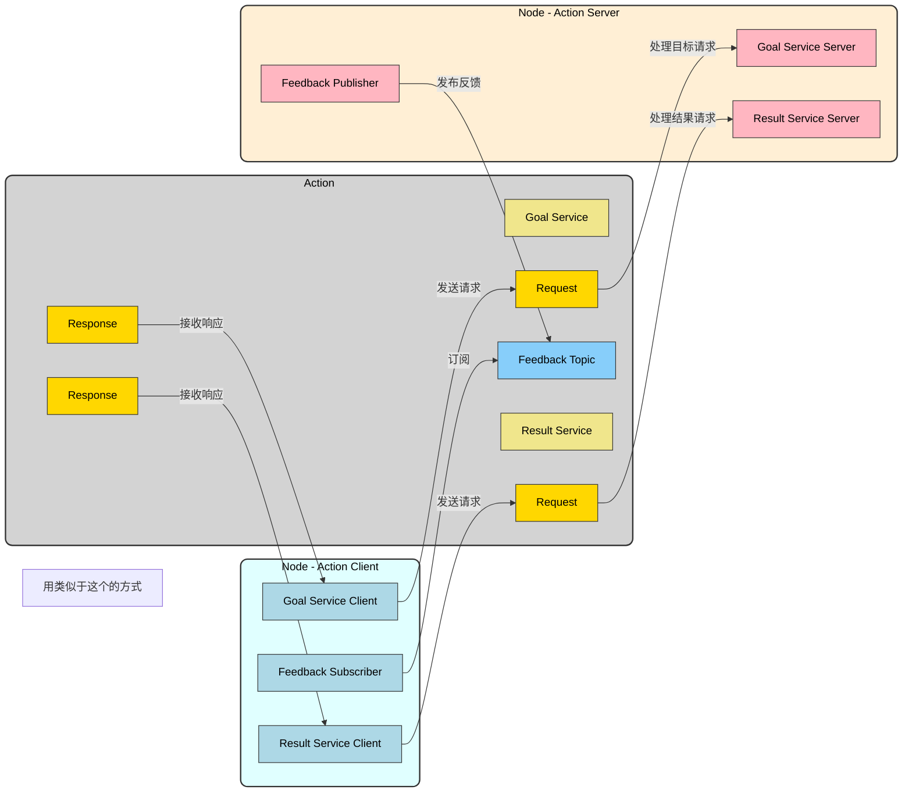
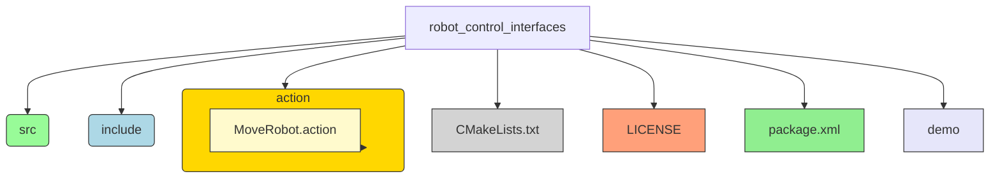
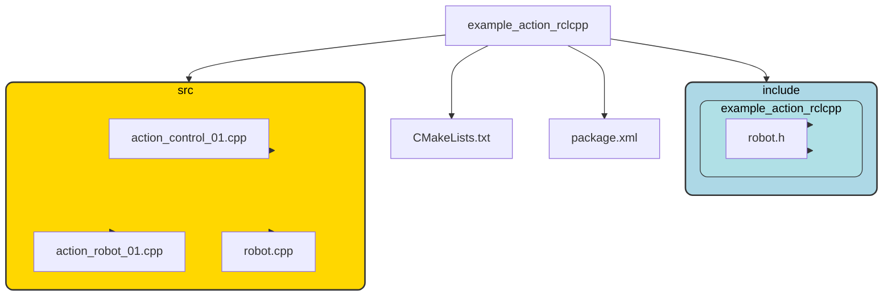

# 动作(action)是什么？

==支持文档与教程==

- [[ros 2 documentation] 编写动作服务器和客户端 (c ++) 待校准@6753](http://dev.ros2.fishros.com/calibpage/#/home?msgid=6753)
- [[fishros] 动作（Action）通信与自定义接口](https://fishros.com/d2lros2/#/humble/chapt4/get_started/4.动作（Action）通信与自定义接口?id=_4动作（action）通信与自定义接口)
- [[古月居] 古月·ROS2入门21讲 | 带你认识一个全新的机器人操作系统](https://www.bilibili.com/video/BV16B4y1Q7jQ?spm_id_from=333.788.videopod.episodes&vd_source=70726c0c4e3073ec08e9566e626253af&p=11)
- [Mermaid(1)流程图(flowcharts)使用详解](https://zhuanlan.zhihu.com/p/683460723)
- [Developing a ROS 2 package](http://docs.ros.org/en/foxy/How-To-Guides/Developing-a-ROS-2-Package.html)
- [【CMake】CMakeLists.txt的超傻瓜手把手教程（附实例源码）](https://blog.csdn.net/qq_38410730/article/details/102477162)

==官方文档==

- [ros2_api](https://docs.ros2.org/latest/api)
- [rclcpp master](https://docs.ros2.org/latest/api/rclcpp/)

- [rclcpp_action master](https://docs.ros2.org/latest/api/rclcpp_action/)

## action背景

- 话题：适用于节点间单向的、频繁的传输
- 服务：适用于节点间的双向的数据传输
- 参数：用于动态调整节点的设置
- 动作：智能地进行某一项复杂的任务（话题和服务的融合，同时可添加一些参数）

==更详细点==

我们在实际的机器人运动中。当我们希望控制机器人从一个出发点移动到一个重点，会存在以下的问题:

1. 你不知道机器人有没有处理移动到目标点的请求（不清楚服务端是否接收到了信号，同时进行处理）
2. 假设机器人收到了请求，但是你不知道机器人此时的位置和距离目标点的距离（没有反馈）
   - 我们之后可以基于反馈，添加更多的逻辑，譬如说躲避障碍

3. 假设机器人移动了一半，你想让机器人停下来，也没有办法通知机器人(单线程的服务，会阻塞程序的进行，此时我们要加入多线程)

**更多的例子**： 

- 控制导航程序，控制机械臂运动、控制小海龟旋转

## action组成

**Action**的三大组成部分：==目标==、==反馈==、==结果==

- 目标：**Client**告诉**Server** 需要做什么，**Server**需要对请求有响应，解决了通信问题
- 反馈：**Server**告诉**Client** 此时进度如何，解决了没有反馈的问题
- 结果：**Server**告诉**Client** 执行结果，结果最后从**Client**输出，用于表示任务的最终结果

### 话题、服务、参数、动作之间的关系

你可以这么认为

​	==话题和服务是构成完整节点的基石==

- 参数是有服务构建出来的
- 动作是由话题和服务构建出来的

**==一个动作 = 三个服务+两个话题==**

- 服务
  1. 目标传递服务
  2. 结果传递服务
  3. 取消执行服务

- 话题
  1. 反馈话题(服务发布、客户端订阅)
  2. 状态话题(服务端发布、客户端订阅)

## 开始启动

### 程序结构
[[action_control_01]][[action_robot_01]]

- 自定义通信接口   **==`robot_control_interfaces`==**

- 机器人节点 **==`example_action_rclcpp`==**

**==在`example_action_rclcpp`中包含的其他依赖==**

1. rclcpp_action                       `rclcpp_action/rclcpp_action.hpp`
2. rclcpp			                `rclcpp/rclcpp.h`