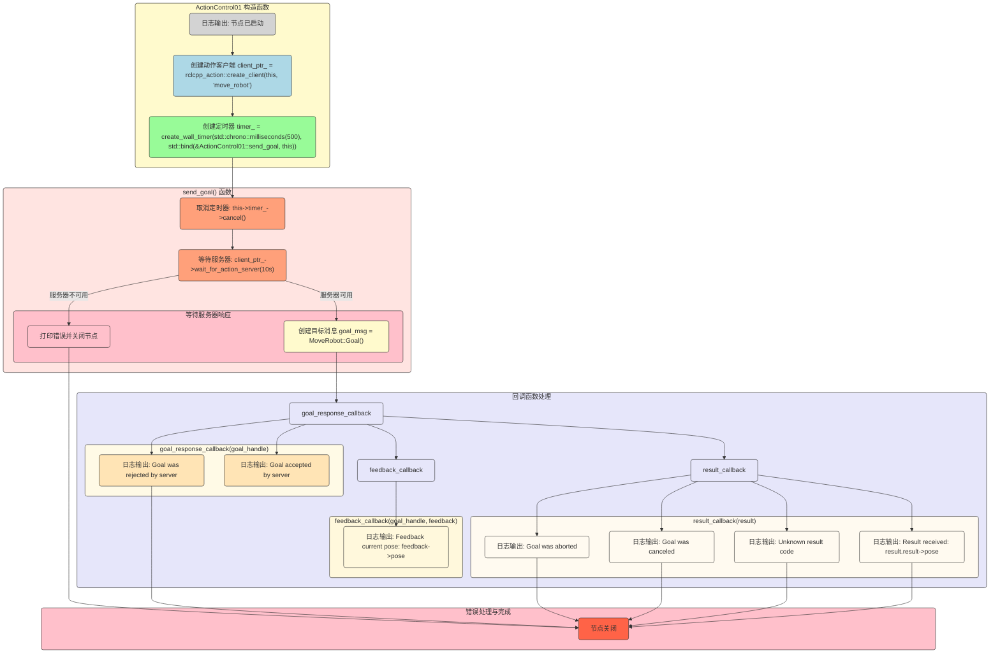

# action_control_01(客户端)

```cpp
#include "example_action_rclcpp/robot.h"
#include "rclcpp/rclcpp.hpp"
#include "rclcpp_action/rclcpp_action.hpp"
#include "robot_control_interfaces/action/move_robot.hpp"

class ActionControl01 : public rclcpp::Node {
    using MoveRobot = robot_control_interfaces::action::MoveRobot;
    using GoalHandleMoveRobot = rclcpp_action::ClientGoalHandle<MoveRobot>;

   public:
    explicit ActionControl01(const std::string name,
                             const rclcpp::NodeOptions& node_options = rclcpp::NodeOptions())
        : Node(name, node_options) {
        RCLCPP_INFO(this->get_logger(), "节点已启动[%s]", name.c_str());

        this->client_ptr_ = rclcpp_action::create_client<MoveRobot>(this, "move_robot");
        this->timer_ = create_wall_timer(std::chrono::milliseconds(500),
                                         std::bind(&ActionControl01::send_goal, this));
    }

    void send_goal() {
        using namespace std::placeholders;

        this->timer_->cancel();

        if (!this->client_ptr_->wait_for_action_server(std::chrono::seconds(10))) {
            RCLCPP_ERROR(this->get_logger(), "Action server not available after waiting");
            rclcpp::shutdown();
            return;
        }

        auto goal_msg = MoveRobot::Goal();
        goal_msg.distance = 10;

        RCLCPP_INFO(this->get_logger(), "Sending goal");

        auto send_goal_options = rclcpp_action::Client<MoveRobot>::SendGoalOptions();
        send_goal_options.goal_response_callback =
            std::bind(&ActionControl01::goal_response_callback, this, _1);
        send_goal_options.feedback_callback =
            std::bind(&ActionControl01::feedback_callback, this, _1, _2);
        send_goal_options.result_callback = std::bind(&ActionControl01::result_callback, this, _1);
        this->client_ptr_->async_send_goal(goal_msg, send_goal_options);
    }

   private:
    rclcpp_action::Client<MoveRobot>::SharedPtr client_ptr_;
    rclcpp::TimerBase::SharedPtr timer_;

    void goal_response_callback(GoalHandleMoveRobot::SharedPtr goal_handle) {
        if (!goal_handle) {
            RCLCPP_INFO(this->get_logger(), "Goal was rejected by server");
        } else {
            RCLCPP_INFO(this->get_logger(), "Goal accepted by server, waiting for result");
        }
    }

    void feedback_callback(GoalHandleMoveRobot::SharedPtr,
                           const std::shared_ptr<const MoveRobot::Feedback> feedback) {
        RCLCPP_INFO(this->get_logger(), "Feedback current pose:%f", feedback->pose);
    }

    void result_callback(const GoalHandleMoveRobot::WrappedResult& result) {
        switch (result.code) {
            case rclcpp_action::ResultCode::SUCCEEDED:
                break;
            case rclcpp_action::ResultCode::ABORTED:
                RCLCPP_ERROR(this->get_logger(), "Goal was aborted");
                return;
            case rclcpp_action::ResultCode::CANCELED:
                RCLCPP_ERROR(this->get_logger(), "Goal was canceled");
                return;
            default:
                RCLCPP_ERROR(this->get_logger(), "Unknown result code");
                return;
        }

        RCLCPP_INFO(this->get_logger(), "Result received: %f", result.result->pose);
    }
};

int main(int argc, char** argv) {
    rclcpp::init(argc, argv);
    auto node = std::make_shared<ActionControl01>("action_robot_01");
    rclcpp::spin(node);
    rclcpp::shutdown();
    return 0;
}
```




## `goal_handle` 的作用总结

==在一开始，我先讲讲goal_handle，一个核心智能指针==

```cpp
using GoalHandleMoveRobot = rclcpp_action::ClientGoalHandle<MoveRobot>;
GoalHandleMoveRobot::SharedPtr goal_handle
```

在上节`action_robot_01`中，我详细提及了`goal_handle`的**服务端**方法以及**寻常使用方法**`is_active()`、`get_status()`

现在我们来介绍一下在**客户端**的**常用方法**

### **`cancel_goal()`**   **（客户端专用）**

- **用途**：客户端向服务器端发送取消请求，用于请求取消已发送的目标（任务）。
  
- **返回值**：`std::shared_future<CancelResponse>`，表示取消请求的异步响应。
  
  - 返回的 `CancelResponse` 包含了取消操作的状态（ `ACCEPTED` 或 `REJECTED`），以指示服务器是否同意取消请求。
  
- **示例**：

  ```cpp
  if (goal_handle->is_active()) {
      auto cancel_future = goal_handle->cancel_goal();
      cancel_future.wait();
      if (cancel_future.get().return_code == rclcpp_action::CancelResponse::ACCEPTED) {
          RCLCPP_INFO(this->get_logger(), "Goal cancel request accepted by server");
      } else {
          RCLCPP_WARN(this->get_logger(), "Goal cancel request was rejected by server");
      }
  }
  ```

- **典型场景**：当客户端决定不再执行某个任务时，调用 `cancel_goal()` 将请求发送给服务器端，例如在路径规划的机器人控制中，客户端可以在发生障碍物时取消当前路径任务并重新规划。

### 客户端与服务端

- **客户端**：用于跟踪特定目标请求的状态，允许客户端查询状态、接收反馈以及在需要时取消目标。
- **服务端**：用于管理和控制目标请求的整个生命周期，从接收请求到提供反馈、完成或取消目标，帮助服务器实时控制任务的执行和状态管理。
- 在代码中，`if (goal_handle)` 的判断语句用于检查 `goal_handle` 是否有效，即是否指向一个有效的目标句柄对象。这种检查通常用于确保服务器端已经接收并处理了客户端发送的目标请求。


### if(!goal_handle)?

`goal_handle` 是一个指向 `rclcpp_action::ClientGoalHandle`（或 `ServerGoalHandle`）对象的**智能指针**,如上面所说的那样。在动作通信中，`goal_handle` 的作用是代表目标任务的句柄，用于跟踪该目标的状态、控制目标的执行和取消等。

- **`if (goal_handle)`**：在 C++ 中，对智能指针进行布尔检查时，实际上是在检查它是否为 `nullptr`。
  - 如果 `goal_handle` 是非空指针==（有效的）==，则表示**服务端**接受了**客户端**发送的目标请求。
  - 如果 `goal_handle` 是空指针（`nullptr`），则表示**服务端**拒绝了**客户端**发送的目标请求。

## 1. `ActionControl01` 类的初始化

```cpp
explicit ActionControl01(const std::string name, const rclcpp::NodeOptions& node_options = rclcpp::NodeOptions())
    : Node(name, node_options) {
    RCLCPP_INFO(this->get_logger(), "节点已启动[%s]", name.c_str());

    this->client_ptr_ = rclcpp_action::create_client<MoveRobot>(this, "move_robot");
    this->timer_ = create_wall_timer(std::chrono::milliseconds(500),
                                     std::bind(&ActionControl01::send_goal, this));
}
```

- **动作客户端初始化**：`client_ptr_` 是指向 `MoveRobot` 类型的动作客户端的**共享指针**。`rclcpp_action::create_client<MoveRobot>` 方法创建了一个动作客户端，专门与 `move_robot` 动作服务器通信。
- **定时器**：设置一个 500 毫秒的定时器，每次触发时调用 `send_goal` 方法。在 `send_goal` 成功启动后，会取消该定时器，防止重复发送。

## timer_

```cpp
this->timer_ = create_wall_timer(std::chrono::milliseconds(500),
                                         std::bind(&ActionControl01::send_goal, this));
```

###  回调函数`send_goal()` 

```cpp
void send_goal() {
    this->timer_->cancel();

    if (!this->client_ptr_->wait_for_action_server(std::chrono::seconds(10))) {
        RCLCPP_ERROR(this->get_logger(), "Action server not available after waiting");
        rclcpp::shutdown();
        return;
    }

    auto goal_msg = MoveRobot::Goal();
    goal_msg.distance = 10;

    RCLCPP_INFO(this->get_logger(), "Sending goal");

    auto send_goal_options = rclcpp_action::Client<MoveRobot>::SendGoalOptions();
    send_goal_options.goal_response_callback =
        std::bind(&ActionControl01::goal_response_callback, this, _1);
    send_goal_options.feedback_callback =
        std::bind(&ActionControl01::feedback_callback, this, _1, _2);
    send_goal_options.result_callback = std::bind(&ActionControl01::result_callback, this, _1);
    this->client_ptr_->async_send_goal(goal_msg, send_goal_options);
}
```

1. **定时器取消**：确保只发送一次目标请求。

- `this->timer_->cancel();` 的作用是取消定时器，以防止重复调用 `send_goal` 方法。但不会销毁它 `timer_` 仍然存在，但不会再触发 `send_goal` 方法。

- ```cpp
  this->timer_ = create_wall_timer(std::chrono::milliseconds(500),
                                   std::bind(&ActionControl01::send_goal, this));
  ```

#### 为什么要取消定时器？

- **避免重复发送**：`send_goal` 只需要被调用一次来发送目标请求。如果不取消定时器，`send_goal` 会每 500 毫秒触发一次，导致多次发送相同的目标请求。
- **控制任务流程**：一旦 `send_goal` 被成功调用，定时器的作用便完成了，接下来的任务交给目标处理的回调函数（如 `goal_response_callback` 和 `result_callback`）处理。因此不再需要定时器触发 `send_goal`。

#### 定时器的销毁与启动

- `timer_->cancel()` :停止定时器。 `timer_` 仍然存在，但不会再触发 `send_goal` 方法。
- `timer_->reset()`:启用定时器。

2. **等待服务器响应**：调用 `wait_for_action_server` 等待最多 10 秒，直到找到**服务端**。

   

3. **创建目标**：创建 `goal_msg`，将目标距离设为 10。

- ```cpp
  #MoveRobot.action   
  # Goal: 要移动的距离
  float32 distance
  ```

4. **设置回调**：为目标响应、反馈和结果设置回调函数，分别为 `goal_response_callback`、`feedback_callback` 和 `result_callback`。

5. **发送目标**：调用 `async_send_goal` 将目标异步发送到**服务端**。

   - ```cpp
     this->client_ptr_->async_send_goal(goal_msg, send_goal_options);
     ```

### `send_goal()`中的**三个回调函数**

#### SendGoalOptions() 的解释

[详细请见官方文档](https://docs.ros2.org/latest/api/rclcpp_action/structrclcpp__action_1_1Client_1_1SendGoalOptions.html)


`rclcpp_action::Client<MoveRobot>::SendGoalOptions` 属于  `rclcpp_action` 。

在**动作客户端**中，`SendGoalOptions` 是一个重要的配置工具，它允许开发者对动作的各个步骤进行精细控制。

##### **作用**

`SendGoalOptions` 是 `rclcpp_action::Client` 的嵌套结构体，提供了以下三个回调选项：

1. **`goal_response_callback`**：当服务器响应客户端的目标请求时触发，用于处理服务器是否接受了目标请求。
2. **`feedback_callback`**：当服务器在任务执行过程中提供反馈时触发，用于接收和处理实时反馈信息。
3. **`result_callback`**：当任务执行结束并返回结果时触发，用于接收并处理任务的最终结果。

#### 如何使用 `SendGoalOptions`？

在动作客户端中，通常会创建一个 `SendGoalOptions` 对象并设置**回调函数**，然后调用 `async_send_goal` 将目标和配置选项发送到服务器

在本代码中，提供了一个模板：

```cpp
auto send_goal_options = rclcpp_action::Client<MoveRobot>::SendGoalOptions();
send_goal_options.goal_response_callback = std::bind(&ActionControl01::goal_response_callback, this, _1);
send_goal_options.feedback_callback = std::bind(&ActionControl01::feedback_callback, this, _1, _2);
send_goal_options.result_callback = std::bind(&ActionControl01::result_callback, this, _1);

this->client_ptr_->async_send_goal(goal_msg, send_goal_options);
```

- 这里的 `goal_msg` 是 `MoveRobot::Goal` 对象，定义了目标任务的具体内容（如目标距离）。
- `async_send_goal` 会将目标请求异步发送到服务器==(发布)==，并自动使用 `send_goal_options` 中的回调函数处理服务器的响应、反馈和最终结果==(反馈)==。

#### 1. `goal_response_callback`：处理目标响应

```cpp
public:
	send_goal_options.goal_response_callback =
        	std::bind(&ActionControl01::goal_response_callback, this, _1);
private:
    void goal_response_callback(GoalHandleMoveRobot::SharedPtr goal_handle) {
        if (!goal_handle) {
            RCLCPP_INFO(this->get_logger(), "Goal was rejected by server");
        } else {
            RCLCPP_INFO(this->get_logger(), "Goal accepted by server, waiting for result");
        }
    }
```

- **类型**：`std::function<void(GoalHandleMoveRobot::SharedPtr)>`
- **作用**：当服务器收到目标请求并响应时调用，用于处理服务器是否接受了该请求。
- **参数**：一个 `GoalHandleMoveRobot::SharedPtr` 类型的指针。这个目标句柄（`goal_handle`）指向该请求的详细信息。
  - 如果 `goal_handle` 不为空，表示目标请求被服务器接受。
  - 如果 `goal_handle` 为空，表示目标请求被拒绝。

#### 2. `feedback_callback`：处理**服务端**的实时反馈

```cpp
public:
 send_goal_options.feedback_callback =
            std::bind(&ActionControl01::feedback_callback, this, _1, _2);
private:
    void feedback_callback(GoalHandleMoveRobot::SharedPtr, const std::shared_ptr<const MoveRobot::Feedback> feedback) {
        RCLCPP_INFO(this->get_logger(), "Feedback current pose:%f", feedback->pose);
    }
```

- **类型**：`std::function<void(GoalHandleMoveRobot::SharedPtr, std::shared_ptr<const MoveRobot::Feedback>)>`
- **作用**：在任务执行过程中，服务器会周期性地发送反馈信息，该回调用于接收和处理这些反馈。
- **参数**：
  - **第一个参数 **: `GoalHandleMoveRobot::SharedPtr`，表示当前目标的句柄。
  - **第二个参数** : `std::shared_ptr<const MoveRobot::Feedback>`，是一个指向 `MoveRobot::Feedback` 的共享指针。const类型...
- **用法**：利用反馈信息实时跟踪任务的进展。例如在控制机器人移动时，可以通过**反馈**更新机器人当前的位置，以便**客户端**可以显示或记录移动过程。

#### 3.`result_callback`：处理**服务端**的最终结果

```cpp
public:
        send_goal_options.result_callback = std::bind(&ActionControl01::result_callback, this, _1);
private:
    void result_callback(const GoalHandleMoveRobot::WrappedResult& result) {
        switch (result.code) {
            case rclcpp_action::ResultCode::SUCCEEDED:
                break;
            case rclcpp_action::ResultCode::ABORTED:
                RCLCPP_ERROR(this->get_logger(), "Goal was aborted");
                return;
            case rclcpp_action::ResultCode::CANCELED:
                RCLCPP_ERROR(this->get_logger(), "Goal was canceled");
                return;
            default:
                RCLCPP_ERROR(this->get_logger(), "Unknown result code");
                return;
        }

        RCLCPP_INFO(this->get_logger(), "Result received: %f", result.result->pose);
}
```

- **类型**：`std::function<void(const GoalHandleMoveRobot::WrappedResult&)>`
- **作用**：当任务执行完成后，服务器会返回最终结果，该回调用于接收和处理最终的任务结果。
- **参数**：一个 `GoalHandleMoveRobot::WrappedResult` 对象。`WrappedResult` 包含任务执行的**结果状态**和**结果数据**。
  - **结果状态**：`result.code` 
    1. **`SUCCEEDED`**：任务成功完成。
    2. **`ABORTED`**：任务被中止。
    3. **`CANCELED`**：任务被取消。
    4. 其他情况视为未知状态。
  - **结果数据**:`result.result` 
    - 指向`MoveRobot::Result` 的指针.
- **用法**：在任务完成时检查**任务状态**(即**结果状态**)，进一步处理结果数据。例如，如果任务成功完成，可以记录机器人最终的位置；如果任务失败或被取消，可以进行日志记录或故障处理。
