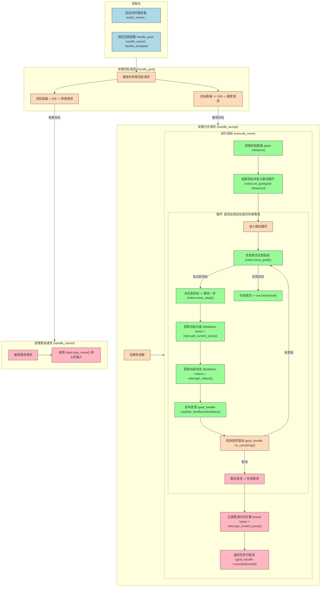

# action_robot_01(服务端)

==重头戏==

```c++
#include "example_action_rclcpp/robot.h"
#include "rclcpp/rclcpp.hpp"
#include "rclcpp_action/rclcpp_action.hpp"
#include "robot_control_interfaces/action/move_robot.hpp"

class ActionRobot01 : public rclcpp::Node {
   public:
    using MoveRobot = robot_control_interfaces::action::MoveRobot;
    using GoalHandleMoveRobot = rclcpp_action::ServerGoalHandle<MoveRobot>;

    explicit ActionRobot01(const std::string name) : Node(name) {
        RCLCPP_INFO(this->get_logger(), "节点已启动[%s]", name.c_str());

        using namespace std::placeholders;  // NOLINT

        this->action_server_ = rclcpp_action::create_server<MoveRobot>(
            this,
            "move_robot",
            std::bind(&ActionRobot01::handle_goal, this, _1, _2),
            std::bind(&ActionRobot01::handle_cancel, this, _1),
            std::bind(&ActionRobot01::handle_accepted, this, _1));
    }

   private:
    Robot robot;
    rclcpp_action::Server<MoveRobot>::SharedPtr action_server_;

    // handle_goal
    rclcpp_action::GoalResponse handle_goal(const rclcpp_action::GoalUUID& uuid,
                                            std::shared_ptr<const MoveRobot::Goal> goal) {
        RCLCPP_INFO(this->get_logger(), "Received goal request with distance %f", goal->distance);
        (void)uuid;

        if (std::fabs(goal->distance) > 100) {
            RCLCPP_WARN(this->get_logger(), "目标距离太远了，本机器人表示拒绝!");
            return rclcpp_action::GoalResponse::REJECT;
        }
        RCLCPP_INFO(this->get_logger(),
                    "目标距离%f我可以走到,本机器人接受,准备触发!",
                    goal->distance);
        return rclcpp_action::GoalResponse::ACCEPT_AND_EXECUTE;
    }

    // handle_cancel
    rclcpp_action::CancelResponse handle_cancel(
        const std::shared_ptr<GoalHandleMoveRobot> goal_handle) {
        RCLCPP_INFO(this->get_logger(), "Received request to cancel goal...");
        (void)goal_handle;
        robot.stop_move();
        return rclcpp_action::CancelResponse::ACCEPT;
    }

    // handle_accepted
    void handle_accepted(const std::shared_ptr<GoalHandleMoveRobot> goal_handle) {
        using std::placeholders::_1;
        std::thread{std::bind(&ActionRobot01::execute_move, this, _1), goal_handle}.detach();
    }
    // handle_accepted 的回调函数
    void execute_move(const std::shared_ptr<GoalHandleMoveRobot> goal_handle) {
        const auto goal = goal_handle->get_goal();
        RCLCPP_INFO(this->get_logger(), "开始执行移动 %f...", goal->distance);

        auto result = std::make_shared<MoveRobot::Result>();
        rclcpp::Rate rate = rclcpp::Rate(2);
        robot.set_goal(goal->distance);

        while (rclcpp::ok() && !robot.close_goal()) {
            robot.move_step();
            auto feedback = std::make_shared<MoveRobot::Feedback>();
            feedback->pose = robot.get_current_pose();
            feedback->status = robot.get_status();

            goal_handle->publish_feedback(feedback);
            //检测任务是否被取消
            if (goal_handle->is_canceling()) {
                result->pose = robot.get_current_pose();
                goal_handle->canceled(result);
                RCLCPP_INFO(this->get_logger(), "Goal Canceled");
                return;
            }
            RCLCPP_INFO(this->get_logger(), "Publish Feedback");
            rate.sleep();
        }

        result->pose = robot.get_current_pose();
        goal_handle->succeed(result);
        RCLCPP_INFO(this->get_logger(), "Goal Succeeded");
    }
};

int main(int argc, char** argv) {
    rclcpp::init(argc, argv);
    auto node = std::make_shared<ActionRobot01>("action_robot_01");
    rclcpp::spin(node);
    rclcpp::shutdown();
    return 0;
}
```

---



---

## 教程代码中的一些问题

### handle_goal

==对于距离的处理问题==

```cpp
if (std::fabs(goal->distance) > 100)    //我的
if (std::fabs(goal->distance  > 100)    //教程
```

---

## 一些依赖

使用了 `using` 关键字来为 `MoveRobot` 和 `GoalHandleMoveRobot` 创建别名.

```cpp
using MoveRobot = robot_control_interfaces::action::MoveRobot;
using GoalHandleMoveRobot = rclcpp_action::ServerGoalHandle<MoveRobot>;
```

### 解释

1. **`using MoveRobot = robot_control_interfaces::action::MoveRobot;`**
   - `robot_control_interfaces::action::MoveRobot` 是一个动作接口，它定义了一个 ROS 2 动作，包括目标（goal）、反馈（feedback）和结果（result）的结构。
2. **`using GoalHandleMoveRobot = rclcpp_action::ServerGoalHandle<MoveRobot>;`**
   - `ServerGoalHandle` 是 ROS 2 中的一个模板类，用于表示 Action Server 的目标句柄。目标句柄包含目标的状态和与客户端交互的方法，例如接受、取消和完成目标。

#### `ServerGoalHandle` 的主要功能

`ServerGoalHandle` 提供了多种方法，用于检查目标的状态、发送反馈、处理取消请求等，这些功能在 ROS 2 动作服务器中非常重要。


==现在goal_handle是一个`GoalHandleMoveRobot`类型的智能指针==   即`rclcpp_action::ServerGoalHandle<MoveRobot>`

```cpp
const std::shared_ptr<GoalHandleMoveRobot> goal_handle
```

##### 2.1 状态管理

- ###### **`is_active()`**

  - 用途：检查目标是否处于“活动”状态。

  - 返回值：`true` 表示目标正在被执行；`false` 表示目标已经完成或被取消。

  - 示例：

    ```cpp
    if (goal_handle->is_active()) {
        // 执行一些操作，因为目标仍然活跃
    }
    ```

  - 典型场景：用于在执行任务的过程中确认目标是否仍然有效，避免执行已经完成或取消的目标。

- ###### **`is_canceling()`**

  - 用途：检查目标是否收到取消请求。

  - 返回值：`true` 表示客户端请求取消该目标；`false` 表示没有取消请求。

  - 示例：

    ```cpp
    if (goal_handle->is_canceling()) {
        // 处理取消逻辑，例如停止任务
    }
    ```

  - 典型场景：在执行过程中检测是否有取消请求，若检测到取消，可以执行停止任务的操作并返回取消结果。

##### 2.2 反馈发送`publish_feedback()`**(服务器端专用）**

- ###### **`publish_feedback()`**的**服务端**如何发送反馈

  - 用途：向客户端发送实时反馈信息。

  - 参数：`std::shared_ptr<const T::Feedback>`，这是一个指向反馈消息的共享指针。

  - 示例：

    ```cpp
    auto feedback = std::make_shared<MoveRobot::Feedback>();
    feedback->pose = robot.get_current_pose();
    feedback->status = robot.get_status();
    goal_handle->publish_feedback(feedback);
    ```

  - 典型场景：在任务执行过程中发布当前的进度和状态，帮助客户端了解任务的执行情况，尤其在长时间执行的任务中非常有用。

    - 具体到这一行代码：

    - ```cpp
      goal_handle->publish_feedback(feedback);	
      ```

      - 这里的 `feedback` 是一个指向 `MoveRobot::Feedback` 结构体的智能指针。该结构体包含了机器人当前的位置信息 `pose` 和状态 `status`，用于描述当前任务的执行状态。发布反馈的步骤如下：

    - **生成反馈消息**：在 `execute_move` 函数中，创建并填充 `feedback` 对象，以包含当前的位置信息和状态信息。

    ```cpp
    auto feedback = std::make_shared<MoveRobot::Feedback>();
    feedback->pose = robot.get_current_pose();
    feedback->status = robot.get_status();
    ```

    - `feedback->pose` 是机器人当前位置，表示机器人在执行任务过程中的位置。
    - `feedback->status` 是机器人的状态，例如“移动中”或“停止”。

  - **调用 `publish_feedback` 发送反馈**：填充 `feedback` 数据后，通过 `goal_handle->publish_feedback(feedback);` 发布此反馈。

    - `publish_feedback` 将 `feedback` 消息发送到与客户端相连的反馈主题（feedback topic,这里是`move_robot`）上。
    - 客户端可以订阅此反馈主题，在任务执行过程中不断接收反馈。

  ######  **`publish_feedback()`**的**客户端**如何处理反馈

  客户端在提交目标请求时，可以选择订阅服务器的反馈主题，以便实时跟踪任务的进展。具体过程如下：

  - 客户端在发送任务请求（goal request）后，开始监听服务器的反馈主题。
  - 每当服务器调用 `goal_handle->publish_feedback(feedback);` 发送反馈时，客户端会收到此消息。
  - 客户端可以根据 `feedback` 消息中的 `pose` 和 `status` 信息，实时更新任务状态，例如在界面上显示机器人当前的位置或任务的进展状态。

  ###### 为什么使用 `publish_feedback`

  - **实时性**：`publish_feedback` 使得服务器可以在任务执行期间实时发布反馈信息，而不是等任务完成后一次性返回结果。对于需要较长时间执行的任务（例如导航、路径规划），实时反馈尤为重要。
  - **任务状态监控**：客户端可以随时获取任务的状态，了解任务是否正常进行，或者是否已完成、取消或遇到障碍。
  - **提高交互性**：实时反馈可以增强客户端和服务器之间的交互性，使得客户端能够对任务的执行情况做出响应（例如，提前取消任务或调整任务参数）。

  **举例说明**

  假设一个机器人在执行路径跟随任务，任务包含多个目标点，任务完成需要较长时间。客户端希望实时监控机器人是否到达每个目标点。在这种情况下：

  - `goal_handle->publish_feedback(feedback);` 可以在每次机器人位置发生显著变化（例如每达到一个新目标点）时调用，将当前位置信息发布为反馈。
  - 客户端接收到反馈后，可以在界面上更新机器人的当前位置，显示机器人正在逐步接近最终目标。
  - 如果客户端发现机器人长时间在某个位置未移动（例如遇到障碍物），可以选择取消任务或者重新规划路径。

##### 2.3 结果处理

- ###### **`succeed()`**  **（服务器端专用）**

  - 用途：标记目标成功完成，并向客户端发送成功的结果。

  - 参数：`std::shared_ptr<const T::Result>`，这是一个指向结果消息的共享指针。

  - 示例：

    ```cpp
    auto result = std::make_shared<MoveRobot::Result>();
    result->pose = robot.get_current_pose();
    goal_handle->succeed(result);
    ```

  - 典型场景：当任务顺利完成后调用，将任务的最终结果发送给客户端，标记任务状态为“成功”。

- ###### **`abort()`**     **（服务器端专用）**

  - 用途：标记目标失败，并向客户端发送失败的结果。

  - 参数：`std::shared_ptr<const T::Result>`，这是一个指向结果消息的共享指针。

  - 示例：

    ```cpp
    auto result = std::make_shared<MoveRobot::Result>();
    goal_handle->abort(result);
    ```

  - 典型场景：当任务由于某些原因无法完成时（例如硬件故障或其他限制），调用 `abort()` 来结束任务并通知客户端任务失败。

- ###### **`canceled()`**   **（服务器端专用）**

  - 用途：标记目标已被取消，并向客户端发送取消结果。

  - 参数：`std::shared_ptr<const T::Result>`，这是一个指向结果消息的共享指针。

  - 示例：

    ```cpp
    auto result = std::make_shared<MoveRobot::Result>();
    result->pose = robot.get_current_pose();
    goal_handle->canceled(result);
    ```

  - 典型场景：当客户端请求取消任务时，调用 `canceled()` 来停止任务，并向客户端发送取消的结果。

#### 总结

- **状态检查**：`is_active()` 和 `is_canceling()` 用于判断当前目标的执行状态和是否收到取消请求。
- **反馈发布**：`publish_feedback()` 提供了实时反馈的能力，适合长时间任务。
- **结果处理**：`succeed()`、`abort()` 和 `canceled()` 用于标记目标的最终状态（成功、失败或取消）。

#### 客户端与服务端

- **客户端**：用于跟踪特定目标请求的状态，允许客户端查询状态、接收反馈以及在需要时取消目标。
- **服务端**：用于管理和控制目标请求的整个生命周期，从接收请求到提供反馈、完成或取消目标，帮助服务器实时控制任务的执行和状态管理。

---

## ActionRobot01()构造函数

```cpp
explicit ActionRobot01(const std::string name) : Node(name) {
    RCLCPP::INFO(this->get_logger(), "节点已启动[%s]", name.c_str());

    using namespace std::placeholders;  // NOLINT

    this->action_server_ = rclcpp_action::create_server<MoveRobot>(
        this,
        "move_robot",
        std::bind(&ActionRobot01::handle_goal, this, _1, _2),
        std::bind(&ActionRobot01::handle_cancel, this, _1),
        std::bind(&ActionRobot01::handle_accepted, this, _1));
}
```

### `explicit` 关键字

你应该注意到了，之前并没有这个前缀.

在 C++ 中，`explicit` 关键字用于构造函数的声明，目的是防止编译器在没有显式调用的情况下，自动进行 **隐式转换** 或 **单参数构造函数的隐式调用**。

#### 作用和示例

在没有 `explicit` 的情况下，单参数构造函数可以被用于隐式类型转换。例如，考虑以下代码：

```cpp
class MyClass {
public:
    MyClass(int x) {}  // 单参数构造函数
};

MyClass obj = 5;  // 合法，但这里发生了隐式转换
```

在上面的代码中，编译器会将 `5` 隐式地转换成 `MyClass` 类型对象。这种隐式转换可能会引入一些不易察觉的错误。通过将构造函数声明为 `explicit`，我们可以避免这样的隐式转换：

```cpp
class MyClass {
public:
    explicit MyClass(int x) {}  // 构造函数前加上 explicit
};

MyClass obj = 5;  // 错误：无法进行隐式转换
MyClass obj(5);   // 合法，显式构造
```

在这个例子中，使用 `explicit` 后，`MyClass obj = 5;` 会导致编译错误，必须写成 `MyClass obj(5);`，即必须显式调用构造函数。

#### 在本代码中的作用

```cpp
explicit ActionRobot01(const std::string name) : Node(name) {
    // ...
}
```

这表示 **不允许** 通过隐式转换的方式创建 `ActionRobot01` 对象。例如，以下代码将被禁止：

```cpp
ActionRobot01 robot = "RobotName";  // 错误，因为构造函数是 explicit 的
```

必须显式地构造对象，如下：

```cpp
ActionRobot01 robot("RobotName");  // 正确
```

### `std::bind`

 `std::bind`是一种用于创建 **可调用对象** 的工具，可以将类方法与参数绑定到一起，以便稍后调用。具体来说：

```cpp
this->action_server_ = rclcpp_action::create_server<MoveRobot>(
    this,
    "move_robot",
    std::bind(&ActionRobot01::handle_goal, this, _1, _2),
    std::bind(&ActionRobot01::handle_cancel, this, _1),
    std::bind(&ActionRobot01::handle_accepted, this, _1));
```

这里的 `create_server` 方法创建了一个 ROS 2 的 `action_server`，`action_server` 可以监听和处理来自客户端的请求。

==详细的可以看我在service服务的那一篇博客==

["Ros2 rclcpp::client service的实现（小鱼笔记）"](https://blog.csdn.net/2402_87385120/article/details/143400421?spm=1001.2014.3001.5502)


- `"move_robot"` 是该 action 的名称。
- `std::bind(&ActionRobot01::handle_goal, this, _1, _2)` 将 `ActionRobot01` 类的成员函数 `handle_goal` 与 `this` 指针（当前对象）绑定，并接受两个参数 `_1` 和 `_2`。
- 类似地，`handle_cancel` 和 `handle_accepted` 也通过 `std::bind` 与 `this` 指针绑定，以便在 action 被取消或接受时调用对应的函数。

#### 总结

- `explicit` 防止隐式转换，确保构造函数只能显式调用。
- `std::bind` 将成员函数绑定到特定对象（`this`）上，并为 action 服务器提供回调函数。

### lambda表达式处理

使用 **lambda 表达式** 来代替 `std::bind`，实现相同的功能。

```cpp
//可以使用auto来简化代码
explicit ActionRobot01(const std::string name) : Node(name) {
    RCLCPP::INFO(this->get_logger(), "节点已启动[%s]", name.c_str());

    using namespace std::placeholders;  // NOLINT

    this->action_server_ = rclcpp_action::create_server<MoveRobot>(
        this,
        "move_robot",
        [this](auto goal_handle, auto goal_request) {
            return this->handle_goal(goal_handle, goal_request);
        },
        [this](auto cancel_handle) {
            return this->handle_cancel(cancel_handle);
        },
        [this](auto accept_handle) {
            return this->handle_accepted(accept_handle);
        });
}
```

```cpp
//使用别名，使得整个代码更为安全
explicit ActionRobot01(const std::string name) : Node(name) {
    RCLCPP::INFO(this->get_logger(), "节点已启动[%s]", name.c_str());

    using ServerGoalHandle = rclcpp_action::ServerGoalHandle<MoveRobot>;  // 为类型定义别名

    this->action_server_ = rclcpp_action::create_server<MoveRobot>(
        this,
        "move_robot",
        [this](const std::shared_ptr<ServerGoalHandle> goal_handle,
               const std::shared_ptr<const MoveRobot::Goal> goal_request) {
            return this->handle_goal(goal_handle, goal_request);
        },
        [this](const std::shared_ptr<ServerGoalHandle> cancel_handle) {
            return this->handle_cancel(cancel_handle);
        },
        [this](const std::shared_ptr<ServerGoalHandle> accept_handle) {
            return this->handle_accepted(accept_handle);
        });
}
```

#### 解释

在这段代码中，`std::bind` 被 lambda 表达式替换：

1. **目标函数 `handle_goal`**:

   ```cpp
   [this](auto goal_handle, auto goal_request) {
       return this->handle_goal(goal_handle, goal_request);
   }
   ```

   这里的 lambda 表达式 `[this](auto goal_handle, auto goal_request)` 等效于 `std::bind(&ActionRobot01::handle_goal, this, _1, _2)`。它捕获 `this` 指针并接受两个参数 `goal_handle` 和 `goal_request`，然后调用 `this->handle_goal`，传入相应参数。

2. **取消回调函数 `handle_cancel`**:

   ```cpp
   [this](auto cancel_handle) {
       return this->handle_cancel(cancel_handle);
   }
   ```

   这部分用 lambda 表达式 `[this](auto cancel_handle)` 替换了 `std::bind(&ActionRobot01::handle_cancel, this, _1)`，捕获 `this` 并接受一个参数 `cancel_handle`，调用 `this->handle_cancel`。

3. **接受回调函数 `handle_accepted`**:

   ```cpp
   [this](auto accept_handle) {
       return this->handle_accepted(accept_handle);
   }
   ```

   这一部分 lambda 表达式 `[this](auto accept_handle)` 捕获 `this`，接受一个参数 `accept_handle`，并调用 `this->handle_accepted`。

---

## handle_goal

```cpp
// handle_goal
rclcpp_action::GoalResponse handle_goal(const rclcpp_action::GoalUUID& uuid,
                                            std::shared_ptr<const MoveRobot::Goal> goal) {
        RCLCPP_INFO(this->get_logger(), "Received goal request with distance %f", goal->distance);
        (void)uuid;

        if (std::fabs(goal->distance) > 100) {
            RCLCPP_WARN(this->get_logger(), "目标距离太远了，本机器人表示拒绝!");
            return rclcpp_action::GoalResponse::REJECT;
        }
        RCLCPP_INFO(this->get_logger(),
                    "目标距离%f我可以走到,本机器人接受,准备触发!",
                    goal->distance);
        return rclcpp_action::GoalResponse::ACCEPT_AND_EXECUTE;
    }
```

### 两个参数

- `const rclcpp_action::GoalUUID& uuid `  

  - 用于识别每个动作请求的标识符。可以将它理解为一个“请求 ID”。当客户端向服务器发送动作请求时，服务器会为每个请求分配一个 `GoalUUID`，以便在多个请求中区分每个请求。
  - 这份独立的标识符可帮助这个节点执行更加复杂的操作，但这里使用`void(uuid)`来消除这个表示，只是目前没有用到。

- `  std::shared_ptr<const MoveRobot::Goal> goal`   

  - 创建一个`<const MoveRobot::Goal> `类型的智能指针 `goal`,注意**const**所放置的位置。

  - ```bash
    #MoveRobot.action   robot_control_interfaces/action
    # Goal: 要移动的距离
    float32 distance
    ```

### rclcpp_action::GoalResponse?

**注意函数开头**,`handle_goal` 函数的返回值类型是 `rclcpp_action::GoalResponse`，这个返回值决定了服务器如何处理收到的目标请求。以下是 `GoalResponse` 中的三种值：

1. **`rclcpp_action::GoalResponse::REJECT`**：拒绝目标请求，服务器不会执行该目标。
2. **`rclcpp_action::GoalResponse::ACCEPT_AND_EXECUTE`**：接受目标请求并立即执行。
3. **`rclcpp_action::GoalResponse::ACCEPT_AND_DEFER`**：接受目标请求，但延迟执行，通常用于需要进一步检查或资源准备的情况。

### 逻辑

1. 当距离大于100，返回`REJECT`,不执行
2. 否则就返回`ACCEPT_AND_EXECUTE`,执行

---

## handle_cancel 

```cpp
    // handle_cancel
    rclcpp_action::CancelResponse handle_cancel(
        const std::shared_ptr<GoalHandleMoveRobot> goal_handle) {
        RCLCPP_INFO(this->get_logger(), "Received request to cancel goal...");
        (void)goal_handle;
        robot.stop_move();
        return rclcpp_action::CancelResponse::ACCEPT;
    }
```

### robot.stop_move()

```cpp
// robot.h
void Robot::stop_move() { status_ = MoveRobot::Feedback::STATUS_STOP; }
```

### 扩展 `handle_cancel` 的用法

如果需要在 `handle_cancel` 中更细致地处理目标取消，比如说顺便发布一下**已经取消的命令**到客户端上，可以扩展为以下形式：

```cpp
rclcpp_action::CancelResponse handle_cancel(
    const std::shared_ptr<GoalHandleMoveRobot> goal_handle) {
    if (goal_handle->is_active()) {
        RCLCPP_INFO(this->get_logger(), "Received request to cancel goal...");
        
        auto feedback = std::make_shared<MoveRobot::Feedback>();
        feedback->status = MoveRobot::Feedback::STATUS_STOP;
        goal_handle->publish_feedback(feedback);
        
        robot.stop_move();
        return rclcpp_action::CancelResponse::ACCEPT;
    }
    RCLCPP_WARN(this->get_logger(), "Goal is not active, cannot cancel.");
    return rclcpp_action::CancelResponse::REJECT;
}
```

---

# handle_accepted

```cpp
    using namespace std::placeholders;  // NOLINT
    // handle_accepted
    void handle_accepted(const std::shared_ptr<GoalHandleMoveRobot> goal_handle) {
        using std::placeholders::_1;
        std::thread{std::bind(&ActionRobot01::execute_move, this, _1), goal_handle}.detach();
    }
```

### 分析

1. **`std::bind`**：`std::bind` 用于将 `execute_move` 方法绑定到 `this` 指针（即当前的实例对象)。`_1` 作为占位符，代表 `std::bind` 中传入的第一个参数。

   - 除了用占位符的方式，我们还可以

   - ```cpp
     void handle_accepted(const std::shared_ptr<GoalHandleMoveRobot> goal_handle) {
         std::thread(&ActionRobot01::execute_move, this, goal_handle).detach();
     }
     
     ```

   - 直接传入`goal_handle`这一个参数

2. **`std::thread`**：`std::thread` 用于启动一个新线程执行 `execute_move`。`goal_handle` 被传递给 `execute_move` 方法。

   - **分离线程（Detached Thread）**： 调用 `detach()` 会将线程与主线程分离，线程会在后台运行，主线程不再等待它的结束。分离线程通常用于不需要再被管理的任务，比如日志记录或非关键性操作。

     ```cpp
     myThread.detach();  // 分离线程，主线程不会等待它完成
     ```

   - **等待线程（Joined Thread）**： 使用 `join()` 可以让主线程等待子线程完成。这通常用于确保所有线程都完成后再继续主线程的后续操作。

     ```cpp
     myThread.join();  // 主线程等待子线程结束
     ```

     

# execute_move()   ---回调函数(复杂)

```cpp
    // handle_accepted 的回调函数
    void execute_move(const std::shared_ptr<GoalHandleMoveRobot> goal_handle) {
        const auto goal = goal_handle->get_goal();
        RCLCPP_INFO(this->get_logger(), "开始执行移动 %f...", goal->distance);

        auto result = std::make_shared<MoveRobot::Result>();
        rclcpp::Rate rate = rclcpp::Rate(2);
        robot.set_goal(goal->distance);

        while (rclcpp::ok() && !robot.close_goal()) {              
            robot.move_step();
            auto feedback = std::make_shared<MoveRobot::Feedback>();
            feedback->pose = robot.get_current_pose();
            feedback->status = robot.get_status();

            goal_handle->publish_feedback(feedback);
            //检测任务是否被取消
            if (goal_handle->is_canceling()) {
                result->pose = robot.get_current_pose();
                goal_handle->canceled(result);
                RCLCPP_INFO(this->get_logger(), "Goal Canceled");
                return;
            }
            RCLCPP_INFO(this->get_logger(), "Publish Feedback");
            rate.sleep();
        }
```

这个 `execute_move` 函数是用于在接收到一个目标请求后异步执行该目标的移动逻辑。它包含一个loop，通过发布反馈和检查取消状态来逐步完成移动任务，直到达到目标或取消任务。

### 代码详解

1. **获取目标**：

   ```cpp
   const auto goal = goal_handle->get_goal();
   ```

   从 `goal_handle` 中获取目标数据（ `goal->distance`），用于确定要移动的距离。

2. **初始化结果和设置频率**：

   ```cpp
   auto result = std::make_shared<MoveRobot::Result>();
   rclcpp::Rate rate(2);
   /*
   # MoveRobot.action
   # Result: 最终的位置
   float32 pose
   */
   ```

   - 创建一个结果对象，用于存储最终的目标位置。
   - `rclcpp::Rate rate(2)` 设置循环频率为 2Hz，即每 0.5 秒循环一次，以控制反馈频率。

3. **设置目标并进入移动循环**：

   ```cpp
   robot.set_goal(goal->distance);
   ```

   调用 `set_goal` 方法将目标距离传给机器人对象，开始执行目标。

   ```cpp
   //robot.cpp
   bool Robot::set_goal(float distance) {
       move_distance_ = distance;
       target_pose_ += move_distance_;
   
       //当目标距离和当前距离大于0.1 ，同意想目标移动
       if (close_goal()) {
           status_ = MoveRobot::Feedback::STATUS_STOP;
           return false;
       }
       status_ = MoveRobot::Feedback::STATUS_MOVING;
       return true;
   }
   ```

4. **主循环：发布反馈并检查取消状态**：

   ```cpp
   while (rclcpp::ok() && !robot.close_goal()) {
       robot.move_step();
       auto feedback = std::make_shared<MoveRobot::Feedback>();
       feedback->pose = robot.get_current_pose();
       feedback->status = robot.get_status();
   
       goal_handle->publish_feedback(feedback);
   }
   
   /*
   robot.cpp
   bool Robot::close_goal() { return fabs(target_pose_ - current_pose_) < 0.01; }
   */
   
   /*
   # MoveRobot.action
   # Feedback: 中间反馈的位置和状态
   float32 pose
   uint32 status
   uint32 STATUS_MOVING = 3
   uint32 STATUS_STOP = 4
   /*
   ```

   - **循环控制**：`rclcpp::ok()` 用于检查节点是否正在运行，`!robot.close_goal()` 用于检测是否已接近目标。
   - **移动一步**：`robot.move_step()` 让机器人在当前方向上移动一步。
   - **发布反馈**：创建反馈消息`publish_feedback`，包含当前 `pose`（位置）和 `status`（状态），并将其发布给客户端。(==详细请见本节开头==`GoalHandleMoveRobot`==的常用方法==)

5. **检查取消请求**：

   ```cpp
   if (goal_handle->is_canceling()) {
       result->pose = robot.get_current_pose();
       goal_handle->canceled(result);
       RCLCPP_INFO(this->get_logger(), "Goal Canceled");
       return;
   }
   /*
   // robot.cpp
   float Robot::get_current_pose() { return current_pose_; }
   */
   ```

   - 使用 `goal_handle->is_canceling()` 检查是否有取消请求。(==详细请见本节开头==`GoalHandleMoveRobot`==的常用方法==)
   - 如果请求取消，将当前位置作为结果的 `pose` 返回，并调用 `goal_handle->canceled(result)` 将任务标记为已取消。

6. **控制循环速率**：

   ```cpp
   rate.sleep();
   ```

   调用 `rate.sleep()` 控制循环速率,即**2HZ**.

   - 为什么上文已经有了`rclcpp::Rate rate(2)`,这里还要`rate.sleep`?
     - 为了保持内部的循环速率一致
     - 诸如`publish_feedback`和`move_step`的方法==（里面内置了一些循环）==，会扰乱**2Hz**的速率

### 总结

这个函数的主要流程是：

1. 设置目标并初始化反馈和结果对象。
2. 进入循环，机器人逐步移动并发布反馈。
3. 每次循环检查是否收到取消请求，收到则终止任务。
4. 到达目标后，循环结束并返回
