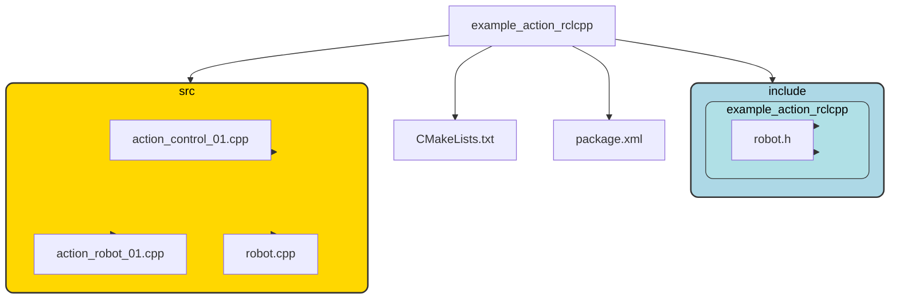

# 机器人节点的定义

## 建立包

pkg包的建立（同时建立了action_robot_01）:

```bash
cd chapt4_ws/
ros2 pkg create example_action_rclcpp --build-type ament_cmake --dependencies rclcpp rclcpp_action robot_control_interfaces --destination-directory src --node-name action_robot_01 --maintainer-name "fishros" --maintainer-email "fishros@foxmail.com" --license Apache-2.0

ros2 pkg create turtle_rclcpp --build-type ament_cmake --dependencies rclcpp geometry_msgs turtlesim robot_control_interfaces --destination-directory src --node-name turtle_control --license Apache-2.0
```

节点及头文件的建立：

```bash
touch src/example_action_rclcpp/src/action_control_01.cpp
touch src/example_action_rclcpp/include/example_action_rclcpp/robot.h
touch src/example_action_rclcpp/src/robot.cpp
```

## 机器人节点的结构



- `robot.h`用于**声明**基本的数据成员和函数方法
- `robot.cpp`用于**定义**在`robot.h`中的函数方法
- `action_robot_01.cpp`实现了机器人的**服务端** --SERVER
- `action_control_01.cpp`实现了机器人的**客户端** --CLIENT
