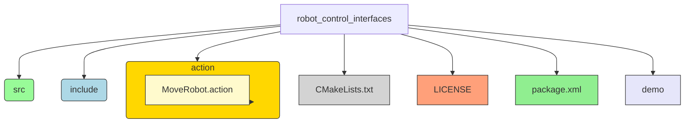
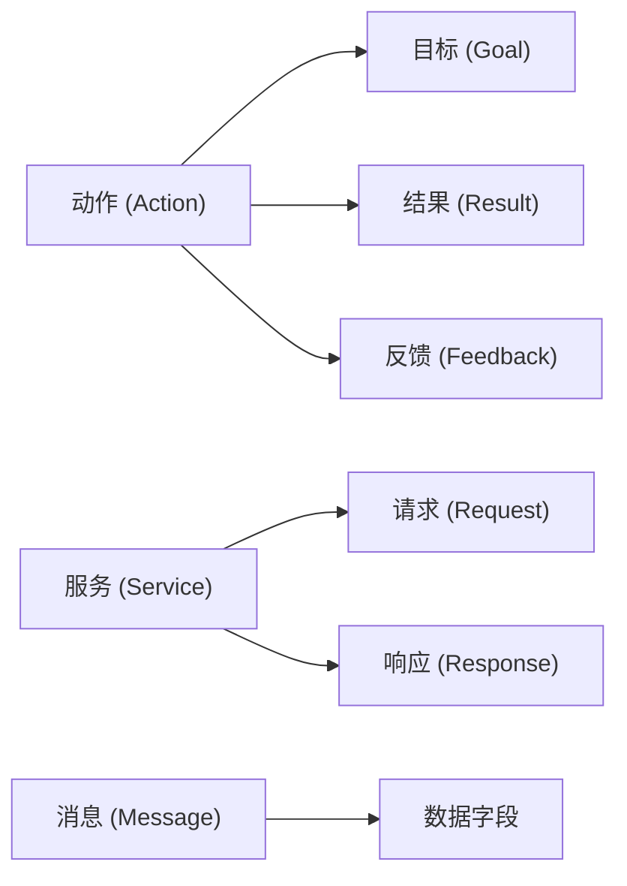

# 接口的建立

## 包的建立

**使用下列命令来在chapt4_ws/src中建立自定义接口**

```bash
cd chapt4_ws/
ros2 pkg create robot_control_interfaces --build-type ament_cmake --destination-directory src --maintainer-name "fishros" --maintainer-email "fishros@foxmail.com" --license Apache-2.0 --dependencies rosidl_default_generators

ros2 pkg create robot_control_interfaces --build-type ament_cmake --destination-directory src --license Apache-2.0 --dependencies rosidl_default_generators

```

### 包建立的一般格式

```bash
ros2 pkg create <package_name> \
--build-type <build_type> \
--dependencies <dependency1> <dependency2> ... \
--destination-directory <directory> \
--node-name <node_name> \
--maintainer-name "<maintainer_name>" \
--maintainer-email "<maintainer_email>" \
--license <license_type> \
--description "<description>" \
--version <version> \
--url <url>
```

#### 参数详细说明

1. **`<package_name>`**  
   包名称。作为 ROS 2 中的唯一标识符。

2. **`--build-type <build_type>`**  
   指定包的构建系统类型。

   - `ament_cmake`：C++ 项目使用。
   - `ament_python`：Python 项目使用。

3. **`--dependencies <dependency1> <dependency2> ...`**  
   包的依赖项列表，用空格分隔。常用依赖：

   - `rclcpp`：C++ 客户端库。
   - `rclpy`：Python 客户端库。
   - `std_msgs`：标准消息包。
   - `sensor_msgs`：传感器消息包。

4. **`--destination-directory <directory>`**  
   新包的创建目录。通常为工作空间的 `src` 目录。

5. **`--node-name <node_name>`**  
   创建一个基础节点的源文件，文件名称与节点名称相同。适用于 C++ 和 Python。

6. **`--maintainer-name "<maintainer_name>"`**  
   指定维护者姓名，将记录在 `package.xml` 文件中。

7. **`--maintainer-email "<maintainer_email>"`**  
   指定维护者的电子邮箱地址，用于联系维护者。

8. **`--license <license_type>`**  
   指定开源协议。常见的协议类型：

   - `Apache-2.0`：Apache 许可证 2.0。
   - `MIT`：MIT 许可证。
   - `BSD-3-Clause`：BSD 3-Clause 许可证。
   - `GPL-3.0`：GNU General Public License v3.0。

   例如：

   ```bash
   --license Apache-2.0
   ```

9. **`--description "<description>"`**  
   包的描述信息，简要说明包的用途和功能。该描述将出现在 `package.xml` 中的 `<description>` 标签中。

   例如：

   ```bash
   --description "This package demonstrates parameter handling in ROS 2."
   ```

10. **`--version <version>`**  
    指定包的版本号。默认版本为 `0.0.0`，可以通过此参数自定义。

    ```bash
    --version 1.0.0
    ```

11. **`--url <url>`**  
    为包指定一个相关网址。

    例如：

    ```bash
    --url "https://github.com/username/repo_name" \
    --url "https://docs.example.com"
    ```

#### 示例命令

以下是一个包含所有常用参数的示例命令：

```bash
ros2 pkg create example_parameters_rclcpp \
--build-type ament_cmake \
--dependencies rclcpp std_msgs sensor_msgs \
--destination-directory src \
--node-name parameters_basic \
--maintainer-name "John Doe" \
--maintainer-email "johndoe@example.com" \
--license Apache-2.0 \
--description "This package demonstrates parameter handling in ROS 2." \
--version 1.0.0 \
--url "https://github.com/johndoe/example_parameters_rclcpp" \
--url "https://johndoe.github.io/docs"
```

#### 生成内容概述

运行上述命令后，ROS 2 将在**指定目录**中生成一个名为 `example_parameters_rclcpp` 的包，并自动包含以下内容：

- **`package.xml`**  
  包含包的元数据信息，如包名称、版本、维护者、开源协议、依赖、描述和网址。

- **`CMakeLists.txt`**  
  配置文件，用于 C++ 项目的构建，包括依赖链接等。

- **`parameters_basic.cpp`**  
  基本的 ROS 2 节点源文件，用于快速启动开发。

- **其他文件**  
  包的标准结构文件，如 `include` 和 `src` 文件夹（如果为 C++ 项目），`launch` 文件夹（用于存放启动文件）等。

### 创建接口文件



```bash
mkdir -p src/robot_control_interfaces/action
touch src/robot_control_interfaces/action/MoveRobot.action
```

==我通常在vscode中建立==

## MoveRobot.action

```cpp
#MoveRobot.action   robot_control_interfaces/action
# Goal: 要移动的距离
float32 distance
---
# Result: 最终的位置
float32 pose
---
# Feedback: 中间反馈的位置和状态
float32 pose
uint32 status
uint32 STATUS_MOVING = 3
uint32 STATUS_STOP = 4
```

## packages.xml

确保有（不过我已经在包建立时做好了）

```bash
  <depend>rosidl_default_generators</depend>
  <member_of_group>rosidl_interface_packages</member_of_group>
```

## CMakeLists.tst

确保有（不过我已经在包建立时做好了）

```bash
find_package(ament_cmake REQUIRED)
find_package(rosidl_default_generators REQUIRED)

rosidl_generate_interfaces(${PROJECT_NAME}
  "action/MoveRobot.action"
)
```

## 确认没有问题

在`chapt4_sw`上执行

```bash
colcon build --packages-select robot_control_interfaces
```

## 不同接口的类型

==rosidl==将根据顺序来识别结构体

使用

```
---
```

分割为不同部分。


比如说当我们执行

```cpp
std::shared_ptr<const MoveRobot::Goal> goal  //MoveRobot是我们的action结构
```

就会自动识别`Goal`

```bash
# Goal: 要移动的距离
float32 distance
```

`goal`这个结构体对象中包含一个`distance`的`foat32`类型变量

也就是说，`MoveRobot`这个`action`接口，第一部分是`Goal`，第二部分是`Result`，第三部分是`Feedback`  --使用注释只是让你明白，`rosidl`并不识别注释。



==特别一提的是==

- **动作**和**服务**的调用类似于`std::shared_ptr<const MoveRobot::Goal> `，`MoveRobot`是整一个`action`文件，`Goal`是包含在这个文件里面的结构体。
- **消息**的调用类似于`std::shared_ptr<example_interfaces::msg::PositionVelocity>`，`PositionVelocity`是一整个`msg`文件，一个`msg`文件对应一个主消息类型，但是它可以引用其他的msg文件，实现嵌套的效果。


