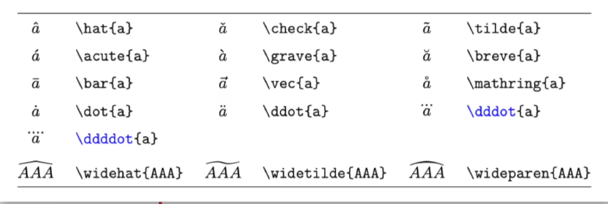
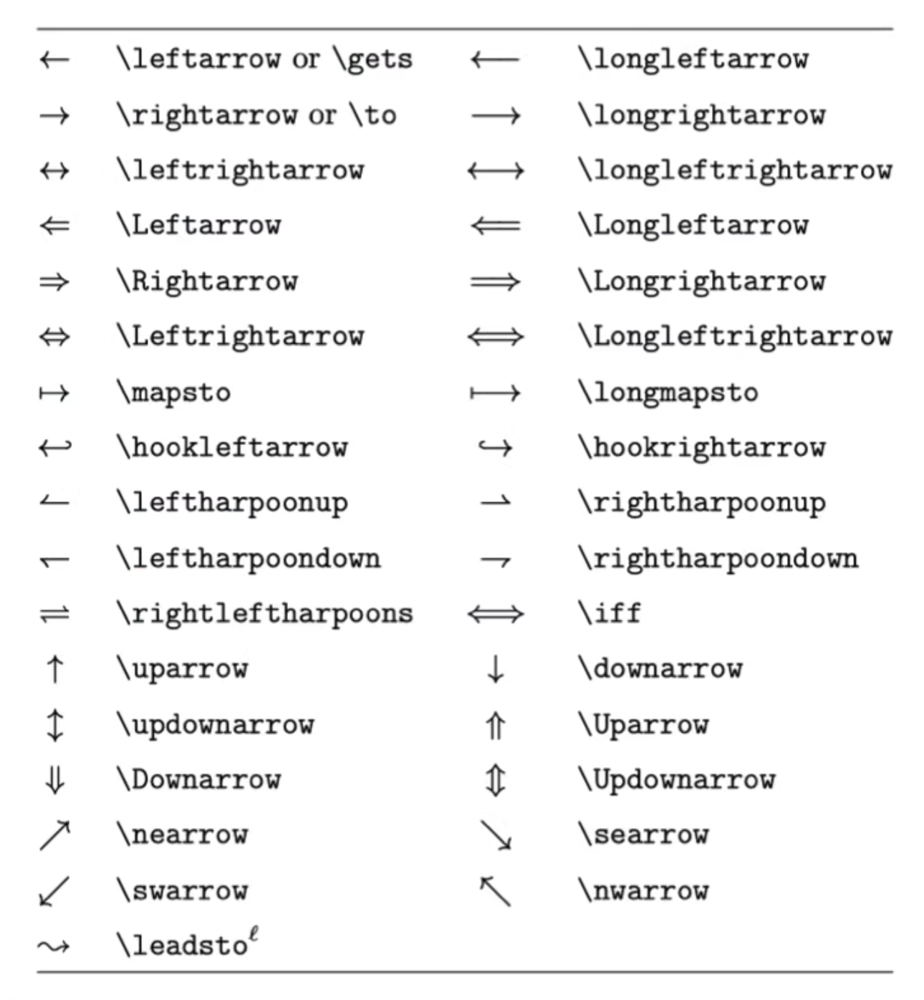

# [LaTeX公式保姆级教程 (以及其中的各种细节)](https://www.bilibili.com/video/BV1no4y1U7At/?spm_id_from=333.1007.top_right_bar_window_default_collection.content.click&vd_source=70726c0c4e3073ec08e9566e626253af)


# 希腊字母

```latex
\delta,\lambda\\
\Delta,\Lambda\\
\Alpha,\Beta\\
\phi,\varphi\\
\epsilon,\varepsilon
```


$$
\delta,\lambda\\
\Delta,\Lambda\\\\
\alpha,\beta\\
\Alpha,\Beta\\\\
\phi,\varphi\\\\
\epsilon,\varepsilon\\
$$

# 上下标

```latex
a^2,a_1\\
x^{y+z},p_{y+z},p_ij\\
```


$$
a^2,a_1\\
x^{y+z},p_{y+z},p_ij\\
$$

在latex之中，英文字母只有表示变量(或单一字符的函数名称，如f(x))时才使用斜体，其余情况都应该使用罗马体(直立体)

比如说下面这个x，左边的是 变量（斜体），右边的是  ==表示输入和输出的x==

```latex
 x_i,x_{\text i}
x_i,x_{\text i}
```


$$
x_i,x_{\text i}
$$
\text 表示空格:  

```latex
\text{A B},\rm{A B}
```


$$
\text{A B},\rm{A B}
$$

## \text 和 \rm

\text 只对最近一个起作用，\rm对后面的所有都起作用  **变成直立体**

```latex
\text A B,\rm A B\\
{\rm A}B
```

$$
\text A B,\rm A B\\
{\rm A}B
$$

然后就是:  ==都应该使用直立体==
	e : 自然对数的底数  为常量

​	i，j:虚数单位   为常量

```latex
\text{e},\text{i}
```

$$
\text{e},\text{i}
$$

# 分式和根式

## 分式

```
\frac{1}{2},\frac 1 2,\frac 1 x\\     \\简单的
\frac 1 {x+y}\\						  \\稍微复杂的
\frac {\frac 1 x+1}{y+1},\frac {\dfrac 1 x+1}{y+1}  //加d使得其变大
```

$$
\frac{1}{2},\frac 1 2,\frac 1 x\\  
\frac 1 {x+y}\\
\frac {\frac 1 x+1}{y+1},\frac {\dfrac 1 x+1}{y+1}
$$

## 根号

```latex
\sqrt 2,\sqrt{x+y},\sqrt[3]{x}
```

$$
\sqrt 2,\sqrt{x+y},\sqrt[3]{x}
$$

# 普通运算符

```latex
+-\\
\times,\cdot,\div\\
\pm,\mp\\
><,\ge,\lg,\gg,\ll,\ne,\approx,\equiv\\
\cap,\cup,\in,\notin,\subset,\subseteq,\subseteqq,\varnothing\\
\forall,\exists,\nexists\\
\because,\therefore\\
\mathbb R,\R,\Q,\N,\Z,\Z_+\\
\mathcal F,\mathscr F
```


$$
+-\\
\times,\cdot,\div\\
\pm,\mp\\
><,\ge,\lg,\gg,\ll,\ne,\approx,\equiv\\
\cap,\cup,\in,\notin,\subset,\subseteq,\subseteqq,\varnothing\\
\forall,\exists,\nexists\\
\because,\therefore\\
\mathbb R,\R,\Q,\N,\Z,\Z_+\\
\mathcal F,\mathscr F
$$

```latex
:\dot.\\
;\dot,\\
\cdots,\vdots,\ddots  #diagonal 对角的
```


$$
:\dot.\\
;\dot,\\
\cdots,\vdots,\ddots
$$

```latex
\infty,\partial,\nabla,\propto ,\degree  #proportional to 正比于
\part 也可以
```

$$
\infty,\partial,\nabla,\propto,\degree\\
\part
$$

```latex
\sin x,\sec x,\cosh x\\
\log_2,\ln x,lg x\\
\lim_{x \to 0} \frac { x}{\sin x}\\
\lim\limits_{x \to 0} \frac{ x}{\sin x}\\
\max x\\
\max\limits_{ x\to 0}     #加入limits可以强制放在max的下面
```

$$
\sin x,\sec x,\cosh x\\
\log_2,\ln x,lg x\\
\lim_{x \to 0} \frac { x}{\sin x}\\
\lim\limits_{x \to 0} \frac{ x}{\sin x}\\
\max x\\
\max\limits_{ x\to 0}
$$

```latex
MSE(x)\\
\text{MSE(x)} #应该使用直立体
```

$$
MSE(x)\\
\text{MSE(x)}
$$


# 大型运算符

```latex
\sum,\prod\\
\sum_i,\sum_{i=0}^N\\
\frac{\sum\limits_{i=1}^n x_i}{\prod\limits_{i=1}^n x_i}
```

$$
\sum,\prod\\
\sum_i,\sum_{i=0}^N\\
\frac{\sum\limits_{i=1}^n x_i}{\prod\limits_{i=1}^n x_i}
$$

```latex
\int,\iint,\iiint,\oint,\oiint\\
\int_{_\infty}^0 f(x)dx\\
\int_{_\infty}^0 f(x)\,\text dx\\   #注意dx需要是直立体
a\,  a\\
a\ a\\
a\quad a\\
a\qquad a\\
```

$$
\int,\iint,\iiint,\oint,\oiint\\
\int_{_\infty}^0 f(x)dx\\
\int_{_\infty}^0 f(x)\,\text dx\\
a\, a\\
a\ a\\
a\quad a\\
a\qquad a\\
$$

# 标注符号

```latex
\vec x,\overrightarrow{AB}\\
\bar x,\overline{AB}
```

$$
\vec x,\overrightarrow{AB}\\
\bar x,\overline{AB}
$$



# 箭头

```latex
\leftarrow,\rightarrow,\Leftrightarrow,\longleftarrow,\longrightarrow
```

$$
\leftarrow,\rightarrow,\Leftrightarrow,\longleftarrow,\longrightarrow
$$



# 括号与定界符

```latex
()\\
[]\\
\{ \}\\
\lceil,\rceil,\lfloor,\rfloor,||\\
(0,\frac 1 a]\\
\left(0,\frac 1 a \right]      #加入left和right可以让符号自适应大小
\frac {\partial f}{\partial x}|_{x=0}\\
\left.\frac {\partial f}{\partial x}\right|_{x=0}   #虚拟括号
```

$$
()\\
[]\\
\{ \}\\
\lceil,\rceil,\lfloor,\rfloor,||\\
(0,\frac 1 a]\\
\left(0,\frac 1 a \right]\\
\frac {\partial f}{\partial x}|_{x=0}\\
\left.\frac {\partial f}{\partial x}\right|_{x=0}
$$

# 多方公式

```latex
\begin{align}
a&=b+c+d\\
&=e+f
\end{align}
```

$$
\begin{align}
a&=b+c+d\\
&=e+f
\end{align}
$$

# 大括号

```latex
f(x)=
\begin{cases}
\sin x,- &\pi\le x \le\pi\\
0,&\text{其他}
\end{cases}
```

$$
f(x)=
\begin{cases}
\sin x,- &\pi\le x \le\pi\\
0,&\text{其他}
\end{cases}
$$


# 矩阵

```latex
\begin{matrix}

a & b & \cdots & c \\
\vdots& \vdots & \ddots & \vdots \\
e & f& \cdots & g

\end{matrix}

\begin{bmatrix}

a & b & \cdots & c \\
\vdots& \vdots & \ddots & \vdots \\
e & f& \cdots & g

\end{bmatrix}


\begin{pmatrix}

a & b & \cdots & c \\
\vdots& \vdots & \ddots & \vdots \\\left(\right)
e & f& \cdots & g

\end{pmatrix}

\begin{vmatrix}

a & b & \cdots & c \\
\vdots& \vdots & \ddots & \vdots \\
e & f& \cdots & g

\end{vmatrix}
\bf A,\bf B^{T}
```

$$
\begin{matrix}

a & b & \cdots & c \\
\vdots& \vdots & \ddots & \vdots \\
e & f& \cdots & g

\end{matrix}

\begin{bmatrix}

a & b & \cdots & c \\
\vdots& \vdots & \ddots & \vdots \\
e & f& \cdots & g

\end{bmatrix}


\begin{pmatrix}

a & b & \cdots & c \\
\vdots& \vdots & \ddots & \vdots \\
e & f& \cdots & g

\end{pmatrix}

\begin{vmatrix}

a & b & \cdots & c \\
\vdots& \vdots & \ddots & \vdots \\
e & f& \cdots & g

\end{vmatrix}
\bf A,\bf B^{T}
$$


# 实战演练

$$
f(x)=\frac 1{\sqrt{2\pi} \sigma}{\rm e}^{-\frac{(x-\mu)^2}{2\sigma^2}}\\

f(x)=\frac 1{ sqrt{2\pi} \sigma} esp\left[ {\frac{(x-\mu)^2}{2\sigma^2}}\right]
$$

$$
\lim\limits_{N\rightarrow \infty}P \left\{ \left| \frac{I\left(\alpha_i \right)}{N} - H\left(s\right) \right| < \varepsilon \right\} = 1
$$

$$
x(n) = \frac 1 {2\pi} \int_{-\pi}^\pi X\left({\rm e}^{{\rm j} \omega}\right){\rm e}^{{\rm j}\omega n} \, {\rm d} \omega
$$

$$
\begin{align}

\vec B \left( \vec r\right)&= \frac{\mu_0}{4\pi}\oint_{C}\frac{I \, {\rm d}\vec l \times \vec R}{R^3}\\

&=\frac{\mu_0}{4\pi}\int_{V} \frac{\vec J_{V} \times \vec R}{R^3} \, {\rm d}V'


\end{align}
$$


# 矩阵相关


$$
R(\theta) = 
\begin{bmatrix}
\cos \theta & -\sin \theta \\
\sin \theta & \cos \theta
\end{bmatrix}
$$

$$
\vec{v}' = R(\theta) \cdot \vec{v} =
\begin{bmatrix}
\cos \theta & -\sin \theta \\
\sin \theta & \cos \theta
\end{bmatrix}
\begin{bmatrix}
x \\
y
\end{bmatrix}
$$

$$
R_z(\theta) =
\begin{bmatrix}
\cos \theta & -\sin \theta & 0 \\
\sin \theta & \cos \theta & 0 \\
0 & 0 & 1
\end{bmatrix}
$$

$$
R = R_x(\alpha) \cdot R_y(\beta) \cdot R_z(\gamma)
$$


